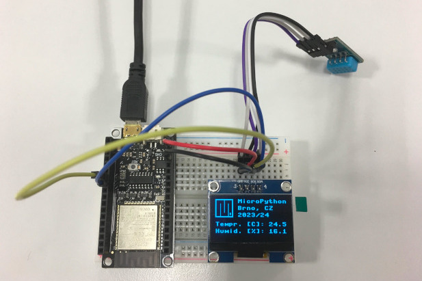
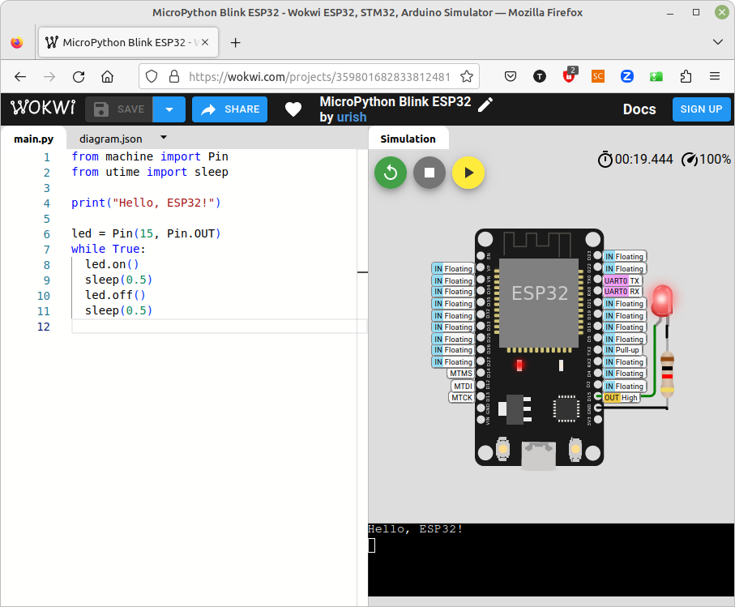

# MicroPython on ESP32/ESP8266 microcontollers

* [Installation](#installation)
* [Usage](#usage)
* [Tools](#tools)
* [Labs](#labs)
* [List of MicroPython examples](#list-of-micropython-examples)
* [Components and tools](#components-and-tools)
* [References](#references)

The repository contains MicroPython lab exercises for [*Erasmus course*](https://www.vut.cz/en/students/courses/detail/279596) at Brno University of Technology, Czechia. The course focuses on advanced digital circuits, microprocessor technology, and use of MicroPython language for programming 32-bit microcontrollers. The course provides practical experience in the design and implementation of embedded systems, allowing students to deepen their programming skills and understanding of individual components within microprocessor systems.

   

## Installation

To use MicroPython with a real ESP32 board, you will need to follow these steps:

* Download MicroPython firmware
* Flash the firmware
* Connect to the Board's Serial REPL and interact with MicroPython
* Transfer files to the ESP32 board

There are several very good tutorials how to install and use MicroPython on an ESP microcontroller, such as [this one](https://pythonforundergradengineers.com/how-to-install-micropython-on-an-esp32.html) for Windows. The following text was tested under Linux-based operating system.

> **NOTE:** The MicroPython firmware can also be flashed by Thonny IDE.

1. Install [Python](https://www.python.org/downloads/).

2. Open terminal (typically `Ctrl+Alt+T`) and install `esptool`:

    ```shell
    pip install esptool
    ```

    Connect your ESP board and test the [`esptool`](https://docs.espressif.com/projects/esptool/en/latest/esp32/esptool/basic-commands.html#):

    ```shell
    # Get the version
    esptool.py version

    # Read chip info, serial port, MAC address, and others
    # Note: Use `dmesg` command to find your USB port
    esptool.py --port /dev/ttyUSB0 flash_id

    # Read all eFuses from the chip
    espefuse.py --port /dev/ttyUSB0 summary
    ```

**For ESP32 chips:**

3. [Download](http://micropython.org/download/) the latest firmware for your target device, such as `esp32-20230426-v1.20.0.bin` for Espressif ESP32.

4. Erase the Flash of target device (use your port name):

    ```shell
    esptool.py --chip esp32 --port /dev/ttyUSB0 erase_flash
    ```

5. Deploy the new firmware:

    ```shell
    esptool.py --chip esp32 --port /dev/ttyUSB0 write_flash -z 0x1000 esp32-20230426-v1.20.0.bin
    ```

**For ESP8266 chips:**

3. [Download](https://micropython.org/download/esp8266/) the latest firmware, such as `esp8266-20230426-v1.20.0.bin`.

4. Erase the Flash before deploying the firmware:

    ```shell
    esptool.py --chip esp8266 --port /dev/ttyUSB0 erase_flash
    ```

5. Deploy the firmware:

    ```shell
    esptool.py --chip esp8266 --port /dev/ttyUSB0 write_flash --flash_mode dio --flash_size 4MB 0x0 esp8266-20230426-v1.20.0.bin
    ```

## Usage

Test MicroPython via [PuTTY](https://putty.org/) or directly in terminal by `screen`. You need to press on-board reset button:

```shell
screen /dev/ttyUSB0 115200
```

> **Note:** To exit the `screen`, press `Ctrl+A`, followed by `K` and `Y`.

```python
# Print string to a Shell
>>> print("Hi there!")
Hi there!

# Operators used for the different functions like division,
# multiplication, addition, subtraction, ...
>>> 10/3
3.333333
>>> 10//3
3
>>> 10%3
1
>>> 10*3
30
>>> 10**3
1000

# Integers, floats, strings
>>> type(10)
<class 'int'>
>>> type(10.0)
<class 'float'>

>>> pi = 3.1415
>>> pi_str = str(pi)
>>> type(pi_str)
<class 'str'>
>>> len(pi_str)
6

# Convert numbers
>>> x = 65
>>> bin(x)  # to binary representation
'0b1000001'
>>> hex(x)  # to hexadecimal
'0x41'
>>> chr(x)  # to unicode string
'A'
>>> ord("a")  # to unicode code
97

# `ord` returns unicode code of a specified character
>>> ord("A")
65
>>> ord("a")
97
>>> ord("0")
48

>>> print(pi_str)
3.1415
>>> ord(pi_str[0])
51
>>> ord(pi_str[-1])
53
```

See MicroPython tutorials, such as [MicroPython Programming Basics with ESP32 and ESP8266](https://randomnerdtutorials.com/micropython-programming-basics-esp32-esp8266/) for detailed explanation.

Test some other useful commands from [Quick reference for the ESP32](https://docs.micropython.org/en/latest/esp32/quickref.html):

```python
# A platform identifier
>>> import sys
>>> sys.platform
'esp32'

# Get the current frequency of the CPU and RTC time
>>> import machine
>>> help(machine)
>>> machine.freq()
>>> machine.RTC().datetime()

# Get Flash size in Bytes
>>> import esp
>>> esp.flash_size()

# Read the internal temperature (in Fahrenheit)
>>> import esp32
>>> esp32.raw_temperature()
# FYI: temp_c = (temp_f-32) * (5/9)
#      temp_f = temp_c * (9/5) + 32
```

## Tools

### Wokwi simulator

[Wokwi](https://wokwi.com/micropython) is a web-based platform for simulating and visualizing electronics projects right in your web browser. You can use it to simulate Arduino, ESP32, STM32, and many other popular boards, parts and sensors in C, MicroPython or Rust language.

   

### ViperIDE

[ViperIDE](https://viper-ide.org/) is a lightweight MicroPython / CircuitPython IDE for Web and Mobile. It provides a clean interface with essential features like a serial console, code uploading, and direct interaction with the MicroPython REPL. Viper IDE allows easy management of files on the microcontroller, real-time code execution, and debugging.

### Thonny IDE

Thonny is an integrated development environment (IDE) designed primarily for Python programming. It provides a user-friendly and beginner-friendly environment for writing, running, and debugging Python code. It can also be used with MicroPython for programming microcontrollers like the ESP8266, ESP32, Raspberry Pi Pico, etc. [Thonny](https://thonny.org/) is available for multiple platforms, including Windows, macOS, and Linux.

### Mu Editor

[Mu](https://codewith.mu/) is another simple Python editor with built-in support for MicroPython. It has an intuitive user interface with easy-to-access buttons for uploading code and interacting with the board. Mu is designed for beginners and education, with features like a REPL, plotter, and simple code running on devices like the BBC micro and ESP32.

### Visual Studio Code with Pymakr extension

Pymakr allows you to connect, upload, and run MicroPython code on boards like the ESP32. It includes features like auto-completion, real-time terminal access to the board, and a file manager.

## Labs

1. [Programming in Python](lab1-python)
2. [Control of GPIO pins](lab2-gpio)
3. [Object-oriented programming](lab3-oop)
4. [Timers](lab4-timers)
5. [LCD (Liquid Crystal Display)](lab5-display)
6. [I2C serial communication](lab6-serial)
7. [Wi-Fi communication](lab7-wifi)
8. [Project](lab8-project)

> **Note**: Documentation for modules used in the labs, created by [Sphinx](manuals/HOWTO_Sphinx.md), is [available here](https://tomas-fryza.github.io/esp-micropython/). 

## List of MicroPython examples

* [Blink](examples/01-blink/main.py)
* [Timer blink](examples/02-timers/main.py)
* [Wi-Fi scan](examples/03-wifi-scan/main.py)
* [Wi-Fi connection](examples/04-wifi-connection/main.py)
* [I2C humidity & temperature sensor](examples/05-i2c-sensor/main.py)
* [I2C sensor & ThingSpeak](examples/06-i2c-sensor-thingspeak/main.py)
* [RTC & NTP times](examples/07-rtc/main.py)
* [Wi-Fi access point](examples/08-access-point/boot.py)
* [Web server & I2C sensor](examples/09-web-server-i2c-sensor/)
* [Jupyter example](examples/99-jupyter/test_micropython.ipynb)

## Components and tools

The following hardware and software components are mainly used in the lab.

| **Component** | **Link(s)** |
| :-- | :-- |
| ESP32 microcontroler | [Expressif](https://www.espressif.com/en/products/socs/esp32) |
| FireBeetle board | [Schematic](manuals/firebeetle_esp32_board_user_manual.pdf) & manual, [pinout](lab2-gpio/images/DFR0478_pinout.png)
| DHT12 | I2C humidity and temperature sensor: [data sheet](manuals/dht12_manual.pdf) |
| MPU6050 | I2C gyroscope and accelerometer: [data sheet](manuals/dht12_manual.pdf) |
| DS3231 | I2C real time clock: [data sheet](manuals/ds3231_manual.pdf) |
| HC-SR04 | ultrasonic sensor: [datasheet](https://components101.com/ultrasonic-sensor-working-pinout-datasheet) |
| Joystick PS2 | Analog [joystick PS2](https://arduino-shop.cz/arduino/884-arduino-joystick-ps2.html)
| Logic analyzer | 24MHz 8-channel [logic analyzer](https://www.ebay.com/sch/i.html?LH_CAds=&_ex_kw=&_fpos=&_fspt=1&_mPrRngCbx=1&_nkw=24mhz%20logic%20analyzer&_sacat=&_sadis=&_sop=12&_udhi=&_udlo=): [software](https://www.saleae.com/)
| Osciloscope DSOX3034T | Oscilloscope Keysight Technologies [DSOX3034T](https://www.keysight.com/en/pdx-x202175-pn-DSOX3034T/oscilloscope-350-mhz-4-analog-channels?&cc=CZ&lc=eng) (350 MHz, 4 analog channels), including 16 logic timing channels [DSOXT3MSO](https://www.keysight.com/en/pdx-x205238-pn-DSOXT3MSO/3000t-x-series-oscilloscope-mso-upgrade?cc=CZ&lc=eng) and serial protocol triggering and decode options [D3000BDLA](https://www.keysight.com/en/pd-2990560-pn-D3000BDLA/ultimate-software-bundle-for-the-3000a-t-x-series?&cc=CZ&lc=eng) |
| Thonny IDE | [Python IDE for beginners](https://thonny.org/) |
| Mu editor | [Python editor](https://codewith.mu/) |
| Visual Studio Code | [web page](https://code.visualstudio.com/) |
| Git | [git](https://git-scm.com/) |

### Tested on

| **Version**                | **Result (yyyy-mm-dd)** | **Note**    |
| :------------------------- | :---------------------: | :---------- |
| macOS Sonoma 14.6.1        | OK (2024-09-03)         | MacBook     |
| Windows 10                 | OK (2023-09-18)         | Lab SC 6.61 |
| Linux Mint 20.3 (Una)      | OK (2023-05-23)         | Laptop      |

```bash
# FYI: How to check OS version in Linux
cat /etc/os-release
# or
neofetch

# How to identify the macOS version
sw_vers
```

## References

1. Peter Kazarinoff. [How to install MicroPython on an ESP32 microcontroller](https://pythonforundergradengineers.com/how-to-install-micropython-on-an-esp32.html)

2. [IDEs for MicroPython](https://github.com/tomas-fryza/esp-micropython/wiki/IDEs-for-MicroPython)

3. [ESP32 brief overview](https://www.youtube.com/watch?v=DoctWoxIaH8) (YouTube video)

4. [Getting started with MicroPython on the ESP32](https://docs.micropython.org/en/latest/esp32/tutorial/intro.html)

5. [Video tutorial about ESP32 MicroPython](https://www.youtube.com/playlist?list=PLw0SimokefZ3uWQoRsyf-gKNSs4Td-0k6)

6. MicroPython Documentation. [Quick reference for the ESP32](https://docs.micropython.org/en/latest/esp32/quickref.html)

7. DFRobot. [250+ Must-read Tutorials for Learning ESP32 and Arduino](https://www.dfrobot.com/blog-1578.html)

8. [40+ MicroPython Projects, Tutorial and Guides with ESP32 / ESP8266](https://randomnerdtutorials.com/projects-esp32-esp8266-micropython/)

9. Rafael Aroca. [ESP32, Camera, MicroPython and NO esptool!](https://rafaelaroca.wordpress.com/2021/07/15/esp32-camera-micropython-and-no-esptool/)
