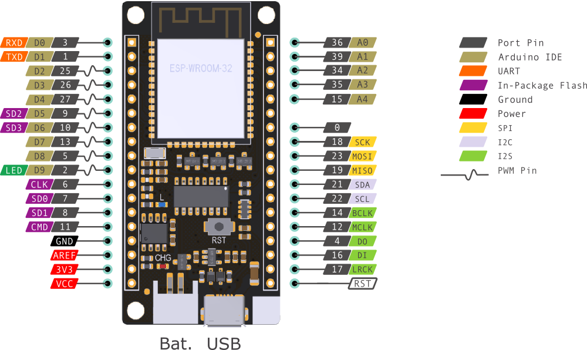
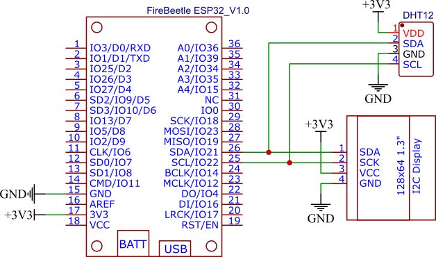
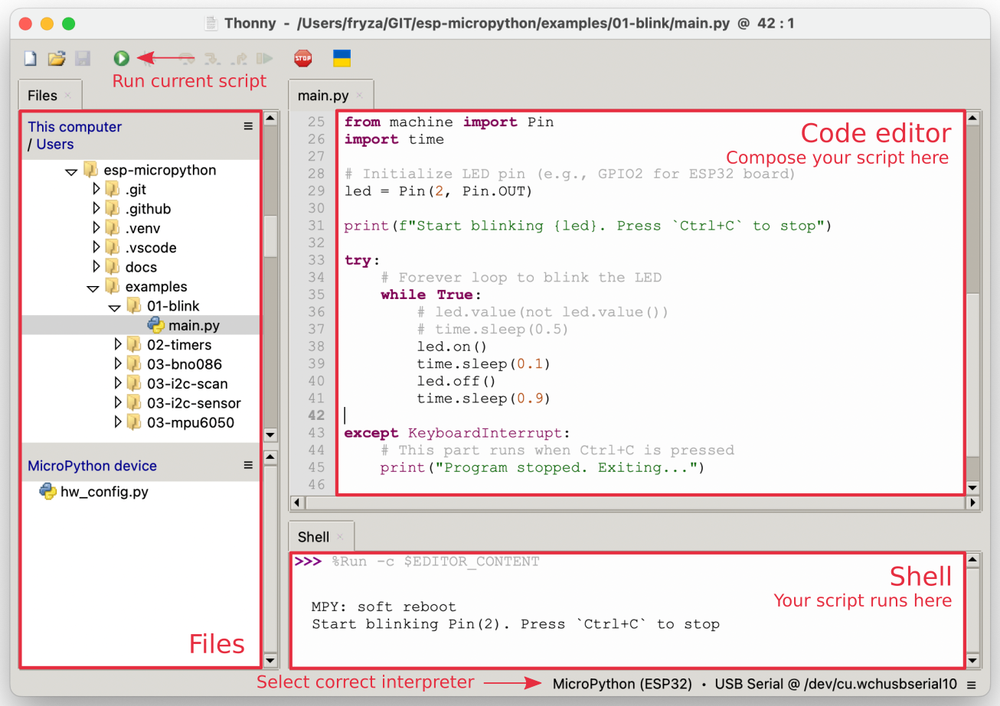
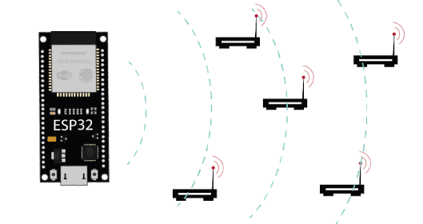

# TechDay FEKT VUT, Workshop IoT: "Měříme svět kolem nás"

## Hardware

* Mikrokontrolér ESP32, Firebeetle board, [https://www.dfrobot.com/product-1590.html](https://www.dfrobot.com/product-1590.html) s nahraným interpreterem MicroPythonu, [https://micropython.org/](https://micropython.org/)

   

* Display OLED a senzor teploty a relativní vlhkosti vzduchu DHT12 (1. varianta) nebo BME280 (2. varianta). Pozn: Kresleno v online editoru EasyEDA [https://easyeda.com/](https://easyeda.com/)

   

## Software

* Thonny, Python IDE for beginners, [https://thonny.org/](https://thonny.org/)

   

### Úkol 1: Blikání LED

Načtení částí modulů v jazyce MicroPython, vytvoření objektu z třídy `Pin` a změna výstupní hodnoty napětí na pinu `2` v nekonečné smyčce. (Na GPIO pinu číslo 2 je nejčastěji připojena LED dioda na vývojových deskách.)

```python
from machine import Pin
from time import sleep_ms

led = Pin(2, Pin.OUT)

# Forever loop
while True:
    led.on()
    sleep_ms(100)
    led.off()
    sleep_ms(900)
```

Přidání kódu pro ošetření přerušení, které je generováno klávesovou zkratkou `Ctrl+C` a které ukončí vykonávání kódu na ESP32.

```python
try:
    # Forever loop
    while True:
        ...

except KeyboardInterrupt:
    # This part runs when Ctrl+C is pressed
    print("Program stopped. Exiting...")

    # Optional cleanup code
    led.off()
```

[Řešení](01-led.py)

### Úkol 2: Komunikace se senzorem pomocí I2C

Načtení potřebných modulů. Pozor, podle typu senzorů je použita třída `DHT12` nebo `BME280`.

```python
# MicroPython builtin modules
from machine import Pin, I2C
from time import sleep

# External module(s)
from dht12 import DHT12
from bme280 import BME280

# Init DHT12 sensor
i2c = I2C(0, scl=Pin(22), sda=Pin(21), freq=100_000)
sensor = DHT12(i2c)  # 1st variant
# sensor = BME280(i2c)  # 2nd variant
```

Čtení dat ze senzoru.

```python
try:
    while True:
        temp, humid = sensor.read_values()  # 1st variant
        # temp, humid, P, A = sensor.read_values()  # 2nd variant
        print(f"T={temp:.1f}°C, H={humid:.1f}%")

        sleep(10)
```

[Řešení](02-temperature-simple.py)

### Úkol 3: Odeslání dat přes Wi-Fi do cloudu

Využití online platformy [ThingSpeak](https://thingspeak.mathworks.com/).

   

| Channel | API key | Public view |
| :--:    | :--:    | :--         |
| 1       | `QQH5QFCZI9HECVTN` | [https://thingspeak.mathworks.com/channels/3374206](https://thingspeak.mathworks.com/channels/3374206) |
| 2       | `ASWU5V84ETQ45NST` | [https://thingspeak.mathworks.com/channels/3148863](https://thingspeak.mathworks.com/channels/3148863) |
| 3       | `IL5UY2KVNASJBQMU` | [https://thingspeak.mathworks.com/channels/3365367](https://thingspeak.mathworks.com/channels/3365367) |
| 4       | `41XVEIVU1SGJ87I3` | [https://thingspeak.mathworks.com/channels/3374211](https://thingspeak.mathworks.com/channels/3374211) |
| 5       | `G7MZ57M0TX6O15ZA` | [https://thingspeak.mathworks.com/channels/3379384](https://thingspeak.mathworks.com/channels/3379384) |
| 6       | `W4L5LBW63V0TD7SN` | [https://thingspeak.mathworks.com/channels/3379395](https://thingspeak.mathworks.com/channels/3379395) |
| 7       | `ETNZCPCR26FQ9JDM` | [https://thingspeak.mathworks.com/channels/3379402](https://thingspeak.mathworks.com/channels/3379402) |
| 8       | `JQT5X5ROPI5DU0A9` | [https://thingspeak.mathworks.com/channels/3379404](https://thingspeak.mathworks.com/channels/3379404) |

[Řešení](03-iot.py)

### Bonus: Skenování Wi-Fi

ESP32 je--ve skenovaním módu--schopno prohledat dostupné přístupové body k Wi-Fi síti v pásmu 2.4 GHz, seřadit je dle síly signálu a získat základní parametry.

   

[Řešení](04-wifi-scan.py)

## Odkazy

1. Bakalářský kurz MicroPython: [https://github.com/tomas-fryza/esp-micropython](https://github.com/tomas-fryza/esp-micropython)
