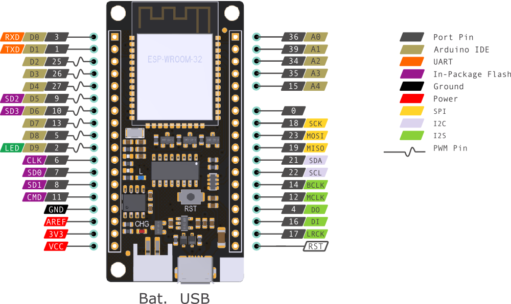
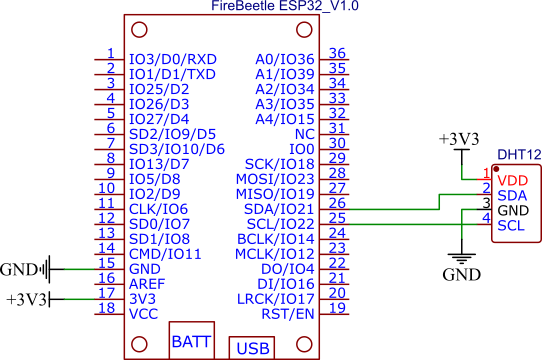
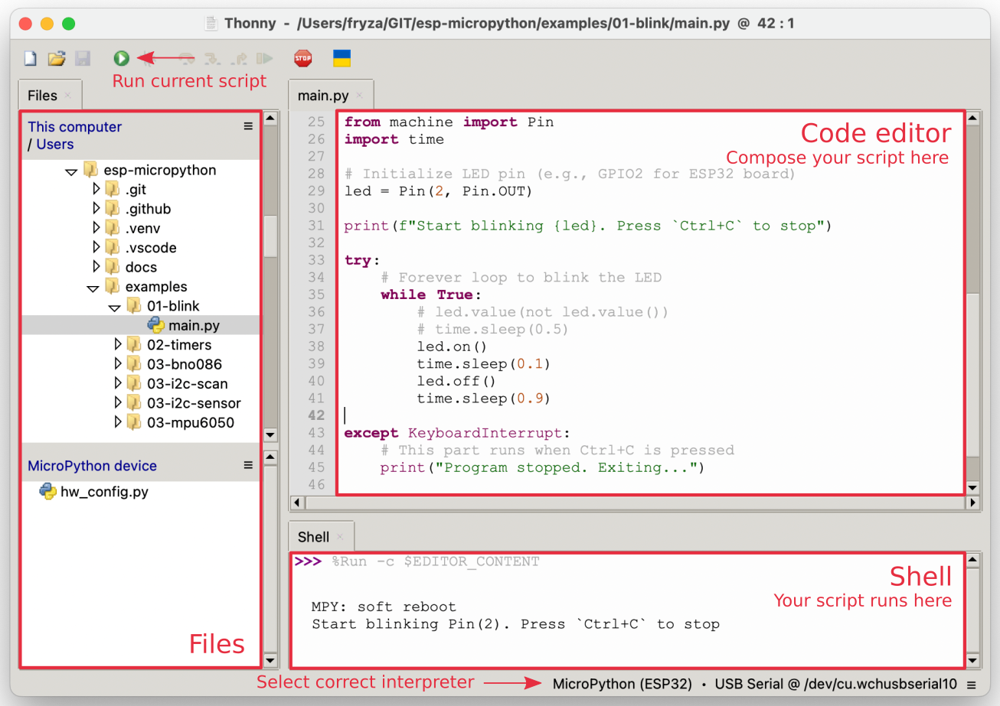
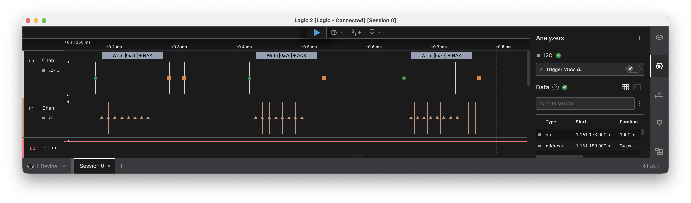
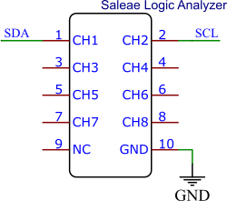
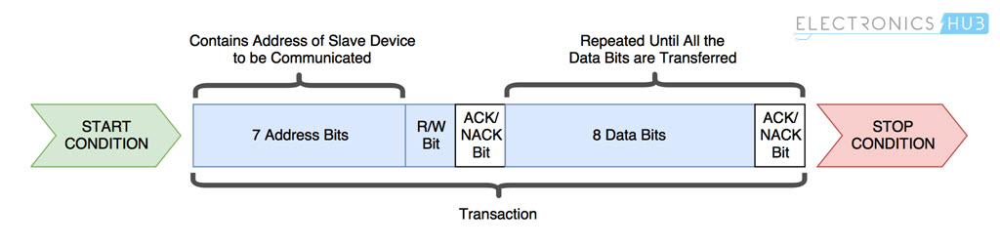
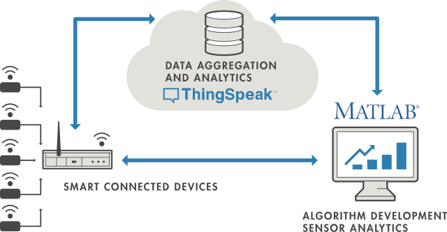
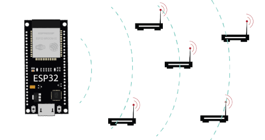

# Microprocessor day, Olomouc

## Hardware

**ESP32** (Firebeetle board, [https://www.dfrobot.com/product-1590.html](https://www.dfrobot.com/product-1590.html)) je výkonný mikrokontrolér určený pro embedded systémy a Internet věcí (IoT). Obsahuje procesor, paměť, digitální vstupy a výstupy a také bezdrátovou komunikaci Wi-Fi a Bluetooth. Na desce je nahrán interpret jazyka MicroPython [https://micropython.org/](https://micropython.org/), takže programy lze spouštět přímo bez kompilace.

   

**BME280** je digitální senzor, který měří teplotu, relativní vlhkost vzduchu a atmosférický tlak. S mikrokontrolérem komunikuje prostřednictvím sběrnice I2C, po které se přenášejí naměřená data.

Pozn: Zapojení kresleno v online editoru EasyEDA [https://easyeda.com/](https://easyeda.com/)

   

## Software

**Thonny** [https://thonny.org/](https://thonny.org/) je jednoduché vývojové prostředí určené především pro výuku programování v Pythonu. Umožňuje editaci programu, jeho spuštění na mikrokontroléru a zobrazení výstupu v integrované konzoli.

   

### Úkol 1: Blikání LED

Prvním krokem bývá ovládání jednoduchého výstupu. V tomto případě budeme měnit stav LED diody připojené k pinu GPIO2. Program střídavě nastavuje logickou úroveň 1 (zapnuto) a 0 (vypnuto) a mezi změnami čeká zadaný čas. (Na GPIO pinu číslo 2 je nejčastěji připojena LED dioda na vývojových deskách.)

```python
from machine import Pin
from time import sleep_ms

led = Pin(2, Pin.OUT)

# Forever loop
while True:
    led.on()
    sleep_ms(100)
    led.off()
    sleep_ms(900)
```

Po spuštění programu běží nekonečná smyčka. V prostředí Thonny lze běžící program ukončit klávesovou zkratkou `Ctrl+C`, která vyvolá výjimku `KeyboardInterrupt`.

```python
try:
    # Forever loop
    while True:
        ...

except KeyboardInterrupt:
    # This part runs when Ctrl+C is pressed
    print("Program stopped. Exiting...")

    # Optional cleanup code
    led.off()
```

[Řešení](01-led.py)

### Úkol 2: Komunikace se senzorem pomocí I2C

Sběrnice I2C umožňuje propojit více zařízení pomocí pouhých dvou vodičů. Jeden vodič přenáší data (`SDA`) a druhý synchronizační hodinový signál (`SCL`).

Po inicializaci rozhraní I2C lze pomocí funkce `scan()` vyhledat všechna zařízení připojená ke sběrnici. Výsledkem je seznam jejich adres.

Knihovna `BME280` zajišťuje veškerou komunikaci se senzorem a poskytuje jednoduché rozhraní pro čtení naměřených hodnot.

```python
# MicroPython builtin modules
from machine import Pin, I2C
from time import sleep

# External module(s)
from bme280 import BME280

# Init I2C
i2c = I2C(0, scl=Pin(22), sda=Pin(21), freq=100_000)
print(i2c.scan())
```

   

Čtení dat ze senzoru.

```python
sensor = BME280(i2c)

try:
    while True:
        temp, humid, press, A = sensor.read_values()
        print(f"T={temp:.1f}°C, H={humid:.1f}%, P={press:.0f}hPa")

        sleep(10)

except KeyboardInterrupt:
    # This part runs when Ctrl+C is pressed
    print("Program stopped. Exiting...")
```

[Řešení](02-temperature.py)

### Úkol 2b: Analýza signálů na sběrnici I2C

Logický analyzátor umožňuje sledovat elektrické signály přímo na vodičích sběrnice. Přestože v programu pracujeme pouze s několika řádky kódu, ve skutečnosti mezi ESP32 a senzorem probíhá výměna binárních dat.

Po spuštění měření lze v aplikaci zobrazit průběhy signálů SDA a SCL a pomocí dekodéru I2C sledovat adresy zařízení i přenášená data. Připojte tři signály (viz obrázek) k logickému analyzátoru.

   

Každé přečtení teploty nebo tlaku je ve skutečnosti série digitálních impulsů na dvou vodičích.

   

### Úkol 3: Odeslání dat přes Wi-Fi do cloudu

ESP32 obsahuje vestavěný Wi-Fi adaptér, díky kterému se může připojit do bezdrátové sítě stejně jako notebook nebo mobilní telefon.

Naměřené hodnoty budeme odesílat do služby [ThingSpeak](https://thingspeak.mathworks.com/), která data ukládá a automaticky z nich vytváří grafy. Výsledky měření tak budou dostupné odkudkoliv prostřednictvím webového prohlížeče.

   

Nové moduly/knihovny:

```python
from network import WLAN, STA_IF

# External modules
from bme280 import BME280
import thingspeak
import wifi_utils
import config

API_KEY = "YOUR_THINGSPEAK_WRITE_API_KEY"
```

Objekt pro bezdrátovou komunikaci:

```python
wifi = WLAN(STA_IF)
```

Připojení k AP a odeslání dat:

```python
        wifi_utils.connect(wifi, config.SSID, config.PSWD)
        thingspeak.send(temp, humid, API_KEY)
        wifi_utils.disconnect(wifi)
```

Pro spuštění [programu](03-iot.py) pak stačí doplnit přihlašovací údaje k Wi-Fi síti v souboru `config.py` a přidělený API klíč pro zápis dat do vašeho kanálu na serveru ThingSpeak.

| Channel | API key | Public view |
| :--:    | :--:    | :--         |
| 1       | `QQH5QFCZI9HECVTN` | [https://thingspeak.mathworks.com/channels/3374206](https://thingspeak.mathworks.com/channels/3374206) |
| 2       | `ASWU5V84ETQ45NST` | [https://thingspeak.mathworks.com/channels/3148863](https://thingspeak.mathworks.com/channels/3148863) |
| 3       | `IL5UY2KVNASJBQMU` | [https://thingspeak.mathworks.com/channels/3365367](https://thingspeak.mathworks.com/channels/3365367) |
| 4       | `41XVEIVU1SGJ87I3` | [https://thingspeak.mathworks.com/channels/3374211](https://thingspeak.mathworks.com/channels/3374211) |
| 5       | `G7MZ57M0TX6O15ZA` | [https://thingspeak.mathworks.com/channels/3379384](https://thingspeak.mathworks.com/channels/3379384) |
| 6       | `W4L5LBW63V0TD7SN` | [https://thingspeak.mathworks.com/channels/3379395](https://thingspeak.mathworks.com/channels/3379395) |
| 7       | `ETNZCPCR26FQ9JDM` | [https://thingspeak.mathworks.com/channels/3379402](https://thingspeak.mathworks.com/channels/3379402) |
| 8       | `JQT5X5ROPI5DU0A9` | [https://thingspeak.mathworks.com/channels/3379404](https://thingspeak.mathworks.com/channels/3379404) |

### Bonus: Skenování Wi-Fi

ESP32 je ve skenovacím režimu schopno prohledat dostupné přístupové body Wi-Fi v pásmu 2,4 GHz, seřadit je podle síly signálu a získat jejich základní parametry.

   

Každá nalezená síť vysílá pravidelně tzv. beacon rámce obsahující informace o názvu sítě (SSID), použitém kanálu, typu zabezpečení a dalších parametrech. ESP32 tyto informace pouze pasivně přijímá a zobrazuje.

Síla signálu se udává v jednotkách dBm. Hodnoty blíže k nule znamenají silnější signál, například −40 dBm představuje velmi dobrý příjem, zatímco −90 dBm značí slabý nebo nestabilní signál.

Tento princip využívají například mobilní telefony a notebooky při zobrazování seznamu dostupných Wi-Fi sítí.

[Řešení](04-wifi-scan.py)

## Odkazy

1. Bakalářský kurz MicroPython: [https://github.com/tomas-fryza/esp-micropython](https://github.com/tomas-fryza/esp-micropython)
