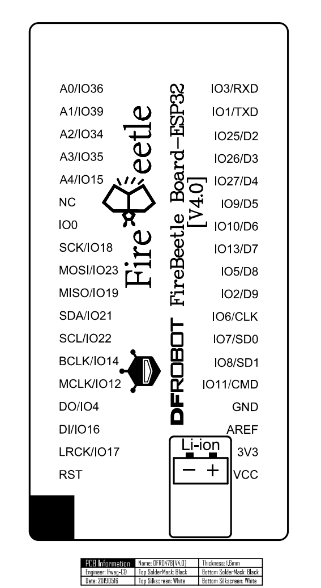

# Lab 2: Control of GPIO pins

* [Pre-Lab preparation](#preparation)
* [Part 1: Blink example](#part1)
* [Part 2: ESP32 pinout and Breadboards](#part2)
* [Part 3: Push buttons and LEDs](#part3)
* [Challenges](#challenges)
* [References](#references)

### Component list

* ESP32 board with pre-installed MicroPython firmware, cable
* Breadboard
* Push button
* 2 LEDs, 2 resistors
* 4x4 matrix keypad
* Jumper wires

### Learning objectives

* Use a breadboard for prototyping.
* Configure input/output pins of ESP32.
* Understand the distinction between active-low and active-high connections.
* Utilize basic I/O components, such as buttons, LEDs, and keypads, in MicroPython.

<a name="preparation"></a>

## Pre-Lab preparation

1. Ensure you have a basic understanding of electronic components, including resistors, LEDs, buttons, as well as concepts like voltage, current, and digital input/output.

2. Review how to write and run MicroPython code on the ESP32 microcontroller. This includes understanding variables, loops, functions, and how to handle input/outputs (I/O) operations.

<a name="part1"></a>

## Part 1: Blink example

1. Connect the ESP32: Ensure your ESP32 board is connected to your computer via a USB cable. Open the Thonny IDE and set the interpreter to `ESP32` or `ESP8266` (depending on your board). You can click the red **Stop/Restart** button or press the on-board reset button if necessary to reset the board.

   

2. Create a New File: Create a new file in Thonny and enter the following MicroPython code:

   ```python
   import time
   import sys

   print("Press `Ctrl+C` to stop")

   try:
       # Forever loop
       while True:
           time.sleep(0.5)

   except KeyboardInterrupt:
       # This part runs when Ctrl+C is pressed
       print("Program stopped")

       # Optional cleanup code

       # Stop program execution
       sys.exit(0)
   ```

   This code includes the necessary imports, a forever loop, and the ability to interrupt/stop the program by pressing `Ctrl+C`. We will use this as a template for all future MicroPython applications.

   > **NOTE:** If you are running the code interactively via the MicroPython REPL (Read-Eval-Print Loop), you can stop the execution by sending a keyboard interrupt (`Ctrl+C`). This works when you are connected to the ESP32's REPL via a terminal or a serial console. When you press `Ctrl+C`, it raises a `KeyboardInterrupt` exception on the main thread, stopping the code execution and returning you to the REPL prompt.

3. The `machine` module in MicroPython provides access to low-level hardware functions, such as controlling GPIO pins on the ESP32 board. You can import the entire module or specific parts (classes) of it:
   
   ```python
   from machine import Pin
   ```

   Set Up the LED: The onboard LED is typically connected to GPIO Pin 2 on most ESP32 boards. Define a pin for the LED:

   ```python
   led = Pin(2, Pin.OUT)
   ```

4. Blinking LED Code: The following code creates an infinite loop where the LED turns on for 0.5 seconds, then off for 0.5 seconds, continuously. The ESP32 controls the onboard LED by sending a HIGH (1) or LOW (0) signal to GPIO Pin 2, which is connected to the LED. The `time.sleep()` function ensures the LED stays on or off for a specific duration.

   ```python
   while True:
       led.on()
       time.sleep(.5)
       led.off()
       time.sleep(.5)
   ```

5. To ensure the LED is turned off when you stop the program, add cleanup code in the exception block:

   ```python
   except KeyboardInterrupt:
       # Optional cleanup code
       led.off()

       # Stop program execution
       sys.exit(0)
   ```

6. Save the file as `blink.py` in your local folder, and run the code. The onboard LED should start blinking on and off every 0.5 seconds. To stop the execution, press `Ctrl+C` in Thonny's terminal.

<a name="part2"></a>

## Part 2: ESP32 pinout and Breadboards

The ESP32 microcontroller board has a number of **GPIO (General Purpose Input/Output) pins** that can be used for various purposes, such as digital input and output, analog input, communication interfaces (e.g., UART, SPI, I2C), PWM (Pulse Width Modulation) output, and more. The exact pinout may vary depending on the specific development board or module you are using. Here is the pinout for Firebeetle ESP32 board used in the lab:

   
   

   > **NOTE:** NC = Empty; VCC = VCC (5V under USB power supply, Around 3.7V under 3.7V lipo battery power supply)

Please note that we will use the numerical designations from the labels **in light blue** to interact with the GPIO pins in MicroPython. For example, we will refer to pins like 3, 1, 25, and so on, for the pins on the left side from the top.

The primary purpose of a **breadboard** (also known as a protoboard or solderless breadboard) is to facilitate the construction and testing of electronic circuits. It allows students to create complex circuits without soldering components together. This is especially important for beginners who are learning electronics and want to experiment with different designs because components can be easily inserted and removed, making it an ideal platform for prototyping and trying out various circuit configurations quickly. Also, breadboards provide a clear visual representation of the circuit layout.

A typical breadboard has rows and columns of interconnected metal clips or sockets, forming a grid. Most breadboards are divided into two halves, usually denoted as the "top" and "bottom" sections. Along the sides of the breadboard, there are usually two long strips, often colored red and blue, which are called the *power rails* used to provide power to your circuits. The red rail is for the positive supply voltage (VCC), and the blue rail is for ground (GND).

The main grid consists of multiple rows and columns. Each row typically contains five interconnected sockets, labeled A, B, C, D, and E. Each column contains interconnected sockets, and columns are often labeled with numbers (1-30, for example). The five sockets within a row are electrically connected. The same goes for sockets within a column; they are electrically connected. The points where the rows and columns intersect are where you can insert and connect components. For example, inserting a wire or component lead into a socket in row "A" and another in column "5" will create an electrical connection between them. For other details see [this](https://computers.tutsplus.com/tutorials/how-to-use-a-breadboard-and-build-a-led-circuit--mac-54746) breadboard description or [that one](https://www.sciencebuddies.org/science-fair-projects/references/how-to-use-a-breadboard).

   

<a name="part3"></a>

## Part 3: Push buttons and LEDs

Active-low and active-high are two different methods of connecting and controlling electronic components, such as LEDs (Light Emitting Diodes) and buttons, to an ESP32 GPIO pin. These methods determine the logic levels required to activate (turn on) or deactivate (turn off) the component.

In an **active-low** configuration, the component is activated or considered "on" when the GPIO pin is at a logic LOW (0V or GND) state. When the GPIO pin transitions to a logic HIGH state (3.3V or VCC), the component is turned off.

In an **active-high** configuration, the component is activated when the GPIO pin is at a logic HIGH (3.3V or VCC) state. When the GPIO pin transitions to a logic LOW state (0V or GND), the component is turned off.

### Buttons

For an active-low button:

* The GPIO pin is connected to one terminal of the button.
* The other terminal is connected to GND.
* The internal (or external) pull-up resistor must be used.
* The button is considered pressed when the GPIO pin reads LOW (0).

For an active-high button:

* The GPIO pin is connected to one terminal of the button.
* The other terminal is connected to VCC (3.3V).
* The internal (or external) pull-down resistor must be used.
* The button is considered pressed when the GPIO pin reads HIGH (1).

   

   Note that, the ESP32 has built-in pull-up and pull-down resistors that can be enabled in software.

   ```python
   from machine import Pin

   # Create Pin objects for the GPIO pins
   button1 = Pin(27, Pin.IN, Pin.PULL_UP)  # Assuming GPIO 27
   button2 = Pin(26, Pin.IN, Pin.PULL_DOWN)
   ```

1. Use breadboard, jumper wires and connect one push button to ESP32 GPIO pin in active-low way. Use GPIO pin number 27.

2. Extend the previous example, and blink the onboard LED only then the button is pressed.

   ```python
   from machine import Pin

   # Define the GPIO pin for the button including internal Pull-up
   button = Pin(27, Pin.IN, Pin.PULL_UP)

   try:
       while True:
           # Check if the button is pressed (active LOW)
           if button.value() == 0:

               # COMPLETE THE CODE

   except KeyboardInterrupt:
       print("Ctrl+C Pressed. Exiting...")

       # Optional cleanup code
   ```

### LEDs

For an active-low LED:

* The GPIO pin is connected to the cathode (shorter lead) of the LED.
* The the anode (longer lead) is connected to resistor and VCC (3.3V).
* The LED lights up when the GPIO pin is set to LOW (0).

For an active-high LED:

* The GPIO pin is connected to the anode (longer lead) of the LED.
* The cathode (shorter lead) is connected to resistor and GND.
* The LED lights up when the GPIO pin is set to HIGH (1).

   

   

1. Use breadboard, jumper wires and connect at least one LED with a resistor to ESP32 GPIO pins in active-high way. Use GPIO pin number 25 or 26.

   > **IMPORTANT:** On the FireBeetle board, GPIO pins 3 and 1 are dedicated to serial communication with the interactive console via UART. To maintain interactivity, it's advisable to refrain from using these pins for other purposes.

2. Write an application when the multiple LEDs (including onboard one) are blinking only if push button is pressed.

   Alternatively, you can use a [3-pin LED](https://lednique.com/leds-with-more-than-two-pins/) with two different colours. The middle lead is a common cathos or anode

   

<a name="challenges"></a>

## Challenges

A **matrix keypad** is a type of input device used to capture user input in the form of numbers, letters, or other characters. It consists of an array of buttons arranged in rows and columns, where each button press represents a unique combination of a row and a column. Matrix keypads are commonly used in various electronic devices, such as calculators and security systems.

1. Connect the rows and columns of the 4x4 matrix keypad to the GPIO pins of the microcontroller. For example, you might connect the rows (R1-R4) to GPIO pins 19, 21, 22, 14 (set as `Pin.OUT`), and the columns (C1-C4) to GPIO pins 12, 4, 16, 17 (set as `Pin.IN, Pin.PULL_UP`).

    

2. Write the code for keypad scanning.

   ```python
   from machine import Pin

   # Enable pull-up on rows and configure columns as outputs
   row_pins = [Pin(pin, Pin.OUT) for pin in (19, 21, 22, 14)]
   col_pins = [Pin(pin, Pin.IN, Pin.PULL_UP) for pin in (12, 4, 16, 17)]

   def scan_keypad():
       key = None

       for row_num in range(len(row_pins)):
           # Set the current row LOW and the rest HIGH
           # COMPLETE THE CODE

           for col_num in range(len(col_pins)):
               # Read the column input
               # COMPLETE THE CODE

      return key


   # Test the code
   while True:
       key_pressed = scan_keypad()
       if key_pressed:
           print(f"Key pressed: {key_pressed}")
   ```

3. Integrate the keypad code with LEDs to control individual LEDs based on keypad button presses.

4. Create a simple, interactive door lock system using a 4x4 keypad, a button, and LEDs. The goal is to simulate a password-protected door:

   * User enters a 4-digit code
   * If an incorrect digit is entered, an "Access Denied" LED blinks.
   * If the correct password is entered, an "Access Granted" LED lights up, simulating the door unlocking.
   * A physical button acts as the door handle. When the door is unlocked, pressing the button simulates opening the door.

<a name="references"></a>

## References

1. Ben Miller. [How to Use a Breadboard and Build a LED Circuit](https://computers.tutsplus.com/tutorials/how-to-use-a-breadboard-and-build-a-led-circuit--mac-54746)

2. Science buddies. [How to Use a Breadboard for Electronics and Circuits](https://www.sciencebuddies.org/science-fair-projects/references/how-to-use-a-breadboard)

3. Tinker Hobby. [Pull Up Resistors](https://www.tinkerhobby.com/pull-up-resistors/)

4. SparkFun Learn. [Pull-up Resistors](https://learn.sparkfun.com/tutorials/pull-up-resistors/all)

5. Physical Computing. [Lesson 1: Using buttons](https://makeabilitylab.github.io/physcomp/arduino/buttons.html)

6. LEDnique. [LED pinouts - 2, 3, 4-pin and more](https://lednique.com/leds-with-more-than-two-pins/)

7. peppe0. [Use Matrix Keypad with Raspberry PI Pico to get User Codes Input](https://peppe8o.com/use-matrix-keypad-with-raspberry-pi-pico-to-get-user-codes-input/)
