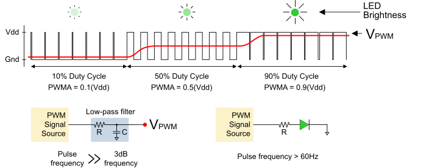

# Lab 3: Object-oriented programming

* [Pre-Lab preparation](#preparation)
* [Part 1: Button class](#part1)
* [Part 2: Inheritance and Led class](#part2)
* [Part 3: PWM and LED](#part3)
* [Challenges](#challenges)
* [References](#references)

### Component list

* ESP32 board with pre-installed MicroPython firmware, USB cable
* Breadboard
* Push button
* Jumper wires

### Learning objectives

* Understand key object-oriented programming (OOP) concepts like encapsulation, inheritance, and polymorphism.
* Define and use classes and objects in MicroPython.
* Apply OOP to manage hardware components like LEDs, buttons, or sensors.

<a name="preparation"></a>

## Pre-Lab preparation

1. Learn the basic principles of OOP, including encapsulating data and functions in classes, inheritance (sharing functions between classes), and polymorphism (modifying behavior in child classes).

2. Review how to use GPIO pins for input and output with MicroPython. How to configure a pin as an output to control an LED. How to configure a pin as an input (with or without pull-up resistors) to detect button presses.

<a name="part1"></a>

## Part 1: Button class

1. Use breadboard, jumper wires and connect one push button to ESP32 GPIO pin 27 in active-low way.

   

   > **Notes:**
   > * NC = Empty, Not Connected
   > * VCC = VCC (5V under USB power supply, Around 3.7V under 3.7V lipo battery power supply)
   > * Use pins A0, ..., A4 as input only
   > * Do not use In-Package Flash pins

2. Ensure your ESP32 board is connected to your computer via a USB cable. Open the Thonny IDE and set the interpreter to `ESP32` or `ESP8266` (depending on your board). You can click the red **Stop/Restart** button or press the on-board reset button if necessary to reset the board.

3. Create a new file in Thonny and enter the following MicroPython code which is a **class definition** for the `Button` class. It is a blueprint for creating objects that represent a physical button with active-low logic connected to the ESP32 (or other microcontroller) GPIO pin.

   ```python
   from machine import Pin


   class Button:
       """
       A class to manage a button connected to a GPIO pin with pull-up resistor.
       """

       def __init__(self, pin_number):
           """Initialize the button on a specific GPIO pin with
              pull-up resistor."""
           self.button = Pin(pin_number, Pin.IN, Pin.PULL_UP)

       def is_pressed(self):
           """Check if the button is currently pressed (active-low logic)."""
           if self.button.value() == 0:  # Pressed button returns 0
               return True
           return False


   # Code inside this block runs only if the script is executed directly
   if __name__ == "__main__" :

       # Example usage of the Button class
       btn = Button(27)

       if btn.is_pressed():
           print(f"Button {btn} pressed...")
       else:
           print(f"Button {btn} released...")
   ```

   Some important parts:

      * The `__init__` method is the **constructor** that is automatically called when a new instance of the Button class is created.

      * Parameter (`pin_number`) represents the GPIO pin number where the button is connected.

      * In Python, `self` is a reference to the current instance of the class and is used to access instance variables and methods within the class.

      * The created object is stored in an instance variable (`self.button`), so it can be used in other methods of the class. Each instance of `Button` has its own `self.button`.

      * The `is_pressed()` method checks if the active-low button is being pressed. When the button is not pressed, the pin remains at logic 1 due to the pull-up resistor.

      * Note that `__name__` is a special built-in variable in Python that holds the name of the module (or script) currently being executed. If the script is being run directly (not imported), `__name__` will be set to `__main__`. The common usage of the `if __name__ == "__main__":` condition in Python is to allow a script to be used both as a **module** and as a **standalone program**. 

4. Save the file as `hw_config.py` in your local folder, run the code and test the button.

<a name="part2"></a>

## Part 2: Inheritance and Led class

Inheritance in Python is a core concept of object-oriented programming that allows a class (called a **child** or **subclass**) to inherit attributes and methods from another class (called a **parent** or **superclass**). This enables the child class to use or extend the functionality of the parent class without rewriting the same code.

1. Using the `Pin` class, create a subclass to complement the pin behavior for the LEDs. Use methods `self.on()`, `self.off()`, and `self.value()` inherited from the `Pin` class.

   ```python
   from machine import Pin
   import time

   ...

   class Led(Pin):  # Led is a subclass of Pin
       """
       A class to control an LED connected to a specified GPIO pin.
       """

       def __init__(self, pin_number):
           """Initialize the LED on a specific GPIO pin."""
           # Calls Parent's __init__ without needing `self`
           super().__init__(pin_number, Pin.OUT)

       def toggle(self):
           """Toggle the LED state."""
           # WRITE YOUR CODE HERE

       def blink(self, duration=0.5, times=5):
           """Make the LED blink a certain number of times."""
           # WRITE YOUR CODE HERE


   # Code inside this block runs only if the script is executed directly
   if __name__ == "__main__" :

       ...

       # Example of using the Led class
       led = Led(2)

       print("LED blinking...")
       led.blink(times=3)

       print("Toggling LED...")
       led.toggle()
       time.sleep(1)

       print("Turning LED off...")
       led.off()
       time.sleep(1)

   ```

   Some important parts:
      
      * Due to inheritance, the `Led` object is also a `Pin` object, and it can use any methods or attributes defined in the `Pin` class.

      * Method `super()` refers to the parent class (`Pin`) and calls its constructor. Python internally uses `self` to figure out the instance for which `super()` is being called, so there's no need to pass it explicitly.

      * Methods `self.on()` and `self.off()` rely on the `on()` and `off()` methods, which come from the `Pin` class. This shows how the `Led` class can use methods inherited from its parent class to implement higher-level functionality like blinking.

2.  Complete and test `toggle()` and `blink()` methods.

<a name="part3"></a>

## Part 3: PWM and LED

PWM (Pulse Width Modulation) is a technique used to control the amount of energy supplied to a device by rapidly switching the power supply on and off. The ratio of the time the signal is on (high) to the time it is off (low) is called the duty cycle, [expressed as a percentage](https://www.realdigital.org/doc/6136c69c3acc4bf52bc2653a067e36cc).


By adjusting the duty cycle, PWM can control the brightness of an LED. A higher duty cycle means the LED is on more often and appears brighter, while a lower duty cycle dims the LED. For example, a 50% duty cycle keeps the LED at half brightness, while 100% makes it fully bright.



1. Using the `PWM` class from `machine` module, create a subclass to complement the pin behavior for the LEDs. Use methods `self.freq()` and `self.duty()` inherited from the `PWM` class.

   ```python
   from machine import Pin
   from machine import PWM
   import time

   ...

   class PwmLed(PWM):  # PwmLed is a subclass of PWM
       """
       A class to control an LED using PWM, allowing for brightness adjustment, fading, and on/off control.
       """

       def __init__(self, pin_number, frequency=1000):
           """Initialize PWM on the given pin with a default frequency and
              starts with a duty cycle of 0 (LED off)."""
           pin = Pin(pin_number, Pin.OUT)
           super().__init__(pin)
           self.freq(frequency)
           self.duty(0)
    
       def set_brightness(self, brightness):
           """Set the LED brightness using PWM (0 to 100%)."""
           duty_cycle = int(brightness / 100 * 1023)  # Duty cycle 0 to 1023
           self.duty(duty_cycle)

       def on(self, brightness=100):
           """Turn the LED on by setting the brightness to 100%."""
           # WRITE YOUR CODE HERE

       def off(self):
           """Turn the LED off by setting the brightness to 0%."""
           # WRITE YOUR CODE HERE

       def fade_in(self, duration=1):
           """Fade in the LED by increasing brightness gradually in 100 steps."""
           step_duration = duration / 100
           for i in range(100):
               self.set_brightness(i)
               time.sleep(step_duration)

       def fade_out(self, duration=1):
           """Fade out the LED by decreasing brightness gradually in 100 steps."""
           # WRITE YOUR CODE HERE


   # Code inside this block runs only if the script is executed directly
   if __name__ == "__main__" :

       ...

       # Example of using the PwmLed class
       led = PwmLed(2)

       print("Fading in...")
       led.fade_in(duration=2)

       print("LED on at 10% brightness...")
       led.on(10)
       time.sleep(1)

       print("Turning LED off...")
       led.off()
       time.sleep(1)
   ```

   Some important parts:
      
      * The frequency `freq` can be a value between 0 and 78125. A frequency of 1000 Hz can be used to control the LED brightness.

      * The duty cycle can be a value between 0 and 1023. In which 1023 corresponds to 100% duty cycle (full brightness), and 0 corresponds to 0% duty cycle.

      * The `range()` function has the following syntax: `range(start, stop, step)`. By default, the `step` parameter is equal to 1.

2.  Complete and test `on()`, `off()`, and `fade_out()` methods.

3. To test if a class is a superclass or a subclass of another class in Python, you can use the built-in functions `issubclass()` and `isinstance()`.

   The `issubclass()` checks if a class is a subclass of another class. It returns `True` if the first argument is a subclass of the second. The `isinstance()` function checks if an object is an instance of a class or a subclass of that class. It returns `True` if the object is an instance of the specified class or any subclass thereof.

   ```python
       print("Testing class relationship...")
       print(issubclass(Led, PwmLed))
       print(isinstance(led, PWM))
   ```

<a name="challenges"></a>

## Challenges

1. Write a program that toggles the LED state (on/off) every time the button is pressed.

2. Control the brightness of an LED using a button. Write a program that increases the brightness by 20% each time the button is pressed. Once it reaches 100%, the next press should reset it to 0%.

3. Create different blinking patterns for an LED based on button presses. Write a program that cycles through three different blinking patterns (e.g., fast, slow, and a double blink) each time the button is pressed.

<a name="references"></a>

## References

1. Fred's Cave. [MicroPython Class Inheritance](https://www.fredscave.com/31-micropython-class-inheritance.html)

2. MicroPython Documentation. [Pulse Width Modulation](https://docs.micropython.org/en/latest/esp32/tutorial/pwm.html)

3. RandomNerdTutorials.com. [ESP32/ESP8266 PWM with MicroPython – Dim LED](https://randomnerdtutorials.com/esp32-esp8266-pwm-micropython/)

4. Real Digital. [Project 4 A Pulse-Width Modulator IP Block](https://www.realdigital.org/doc/6136c69c3acc4bf52bc2653a067e36cc). Creating and programming a PWM circuit to control LED brightness
