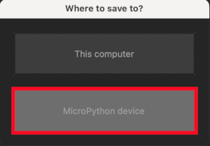

# Lab 4: Timers

* [Pre-Lab preparation](#preparation)
* [Part 1: Interrupts](#part1)
* [Part 2: ESP32 timers](#part2)
* [Part 3: Simple timer-controled tasks](#part3)
* [Challenges](#challenges)
* [References](#references)

### Component list
 
* ESP32 board with pre-installed MicroPython firmware, USB cable
* Breadboard
* 2 LEDs, 2 resistors
* Jumper wires

### Learning objectives

* Understand interrupts, including what they are and how they function within a microcontroller.
* Use internal microcontroller timers.
* Write and modify MicroPython code to initialize and use the timer in the ESP32.
* Develop an understanding of how to schedule multiple tasks based on timer interrupts.

<a name="preparation"></a>

## Pre-Lab preparation

1. Students should study the concepts of interrupts and timers in embedded systems, including the role of Interrupt Service Routines (ISRs) and the difference between periodic and one-shot timer modes.

2. Finish the definition of the custom module `io_control.py` for controlling the LEDs and buttons from the last lab.

<a name="part1"></a>

## Part 1: Interrupts

Interrupts can be triggered by both internal and external devices within the microcontroller unit (MCU). It represents a signal **Interrupt request** sent to the processor by hardware or software, signifying an event that requires immediate attention. When an interrupt is triggered, the controller finishes executing the current instruction and proceeds to execute an **Interrupt Service Routine (ISR)** or Interrupt Handler. ISR tells the processor or controller what to do when the [interrupt occurs](https://www.tutorialspoint.com/embedded_systems/es_interrupts.htm). After the interrupt code is executed, the program continues exactly where it left off.


Interrupts can be set up for events such as a counter's value, a pin changing state, receiving data through serial communication, or when the Analog-to-Digital Converter has completed the conversion process.

<a name="part2"></a>

## Part 2: ESP32 timers

A timer (or counter) is an integral hardware component in a microcontroller unit designed for measuring time-based events. Timers count from 0 to (2^n -1), where `n` being the number of bits of the counter. Thus, an 8-bit counter will count from 0 to 255, a 16-bit counter will count from 0 to 65,535, and so on.

The ESP32 microcontroller has two timer groups, and each group contains two 64-bit timers. This means there are a total of four 64-bit timers, labeled as Timer0, Timer1, Timer2, and Timer3. All of these timers use 16-bit prescalers and 64-bit up/down counters. They also support auto-reload functionality.


Prescalers are used to divide the base clock frequency of the ESP32, which is typically 80 MHz—a frequency that can be too high for some applications. The ESP32 features a 16-bit prescaler, allowing you to divide the base clock frequency by any value between 2 and 65,536. For example, dividing 80 MHz by 65,536 results in approximately 1.22 kHz.

This means the timer frequency can be adjusted from 1.22 kHz up to 80 MHz, in discrete steps. This wide frequency range, combined with the fact that these are 64-bit timers, ensures that the ESP32 can handle almost any timing interval needed for various applications.

Timer interrupts are an efficient way to run non-blocking functions at specific intervals. To achieve this, you can configure a timer and attach it to a specific Interrupt Service Routine (ISR) or handler.

1. Ensure your ESP32 board is connected to your computer via a USB cable. Open the Thonny IDE and set the interpreter to `ESP32` or `ESP8266` (depending on your board). You can click the red **Stop/Restart** button or press the on-board reset button if necessary to reset the board.

2. Create a new file in Thonny and enter the following MicroPython code, which serves as a template for using timers. The `machine.Timer` class in MicroPython provides a way to set up and run a timer that calls a function (callback) either at regular intervals (periodically) or once after a delay.

   In this code, the function will be automatically called by Timer0 every time the timer period is reached.

   ```python
   from machine import Timer
   import sys


   def timer_handler(t):
       """Interrupt handler for Timer."""
       print(f"Handler of {t} executed")


   # Create an object for 64-bit Timer ID 0
   tim = Timer(0)

   # Initialize the timer to call the handler every 1000 s
   tim.init(period=1000,             # Timer period in milliseconds
            mode=Timer.PERIODIC,     # Set the timer to repeat after each period
            callback=timer_handler)  # Function to call when the timer triggers

   print("Timer started. Press `Ctrl+C` to stop")

   try:
       # Forever loop to keep the program running
       # The timer runs independently in the background
       while True:
           pass

   except KeyboardInterrupt:
       # This part runs when Ctrl+C is pressed
       print("Program stopped. Exiting...")

       # Optional cleanup code
       tim.deinit()  # Stop the timer

       # Stop program execution
       sys.exit(0)
   ```

   Some important notes:

      * The function `timer_handler(t)` is defined to act as the interrupt service routine (ISR). The parameter `t` (the Timer object) is passed when the interrupt occurs.
      * The number of different IDs you can use for timers in MicroPython depends on the specific hardware platform you are working with. For example, if the platform supports four timers, the valid IDs would typically be 0, 1, 2, and 3. Here, ID=4 will refer to ID 0, etc.
      * The timer initialization uses `period` to set the timer period in milliseconds or `freq` to set the timer frequency in units of Hz.
      * `mode` can be `Timer.ONE_SHOT` or `Timer.PERIODIC`.
      * `callback` is executed whenever a timer is triggered.
      * In Python, the `pass` keyword is a null operation; it serves as a placeholder in code where a statement is syntactically required but you don't want to execute any code.
      * Note that the timer is running even when program is stopped. Call `tim.deinit()` to stop and clean up the timer, releasing any associated resources.

3. Modify the template above, define a GPIO pin 2 and blink the on-board LED with a period of 1 sec. Try different Timer modes.

<a name="part3"></a>

## Part 3: Simple timer-controled tasks

Using the main timer interrupt of the ESP32 in MicroPython is an effective way to precisely control timing for multiple tasks or applications. You can implement a fine-grained time domain (e.g., milliseconds) and have each task run based on its own multiple of this base period (e.g., every 1 ms, 10 ms, 100 ms), providing precise and customizable intervals.

To achieve this, define global variables that keep track of time intervals, allowing for synchronization between the timer interrupt and the main loop. Within the timer interrupt, increment these variables regularly. Both the timer interrupt and the main program loop can then access these variables to perform tasks based on the elapsed time.

1. Use breadboard, jumper wires and connect two additional LEDs and resistors to ESP32 GPIO pins 25 and 26 in active-high way.

   

   > **Notes:**
   > * NC = Empty, Not Connected
   > * VCC = VCC (5V under USB power supply, Around 3.7V under 3.7V lipo battery power supply)
   > * Use pins A0, ..., A4 as input only
   > * Do not use In-Package Flash pins

2. Save the module `io_control.py` from the previous lab to the ESP32 memory: **File > Save as... > MicroPython device**. Now, you can accsess classes defined within this Python file.

   

3. Create a new source file in your local folder and use the following code to control a single task `a` by Timer interrupt.

   ```python
   from machine import Timer
   from io_control import Led
   import sys

   # Initialize global counter(s) for different task(s)
   counter_a = 0


   def timer_handler(t):
       """Interrupt handler for Timer runs every 1 millisecond."""
       global counter_a

       # Increment counter(s)
       counter_a += 1


   def task_a():
       print(f"Task A executed: onboard LED at {led_onboard}")
       led_onboard.toggle()


   # Create and initialize the timer
   tim = Timer(0)
   tim.init(period=1,  # 1 millisecond
            mode=Timer.PERIODIC,
            callback=timer_handler)

   # Create object(s) for LED(s)
   led_onboard = Led(2)

   print("Timer started. Press `Ctrl+C` to stop")

   try:
       # Forever loop
       while True:
           # Task A (every 500ms)
           if counter_a >= 500:
               counter_a = 0  # Reset the counter
               task_a()  # Run the task

   except KeyboardInterrupt:
       # This part runs when Ctrl+C is pressed
       print("Program stopped. Exiting...")

       # Optional cleanup code
       tim.deinit()  # Stop the timer
       led_onboard.off()

       # Stop program execution
       sys.exit(0)
   ```

Some important notes:

   * Modules you are importing must be stored on ESP32 device.
   * You must use the `global` keyword for variables (defined at the module level, ie outside of any function) that you want to modify inside a function, such as the counter variables in the interrupt handler.
   * You can access global objects (like `led_onboard`) directly without needing to declare them as `global`, provided you are not trying to reassign them.

4. Enhance the previous timer code by adding two counters and corresponding tasks that will blink two external LEDs at different intervals.

<a name="challenges"></a>

## Challenges

1. Enhance the existing timer-based task implementation by allowing each task to execute at a variable interval that can be changed dynamically. Modify the existing timer code to introduce an additional global variable for each task that defines its execution interval. Implement a mechanism to change these intervals at runtime. For example, students could use button presses or serial commands to increase or decrease the blink interval of the LEDs.

2. Simulate a simple traffic light system using three LEDs (red, yellow, green) controlled by a button. Implement a timer to handle the traffic light transitions:

   * Red for 5 seconds
   * Green for 5 seconds
   * Yellow for 2 seconds
   
   Add a button that can be used to manually switch the traffic light to red, overriding the automatic sequence. For example, if the button is pressed, the light should turn red immediately and return to the automatic cycle after a defined delay.

<a name="references"></a>

## References

1. MicroPython documentation. [class Timer -- control hardware timers](https://docs.micropython.org/en/latest/library/machine.Timer.html)

2. Physical Computing. [Lesson 3: Fading an LED with PWM](https://makeabilitylab.github.io/physcomp/esp32/led-fade.html)

3. Nikhil Agnihotri. [MicroPython -- Generating PWM on ESP8266 and ESP32](https://www.engineersgarage.com/micropython-esp8266-esp32-pwm-led-fading/)

4. MicroPython documentation. [class PWM -- pulse width modulation](https://docs.micropython.org/en/latest/library/machine.PWM.html)
