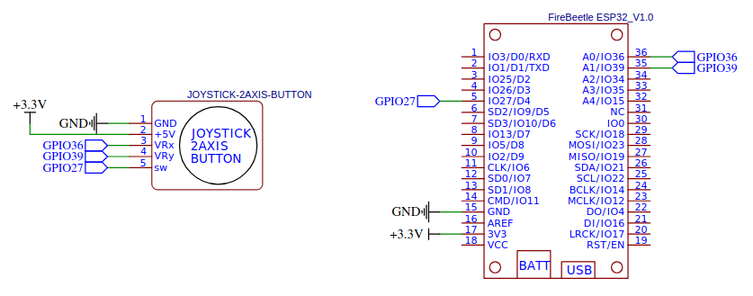

# Lab 5: ADC (Analog-to-Digital Converter)

* [Pre-Lab preparation](#preparation)
* [Part 1: Analog-to-Digital Conversion](#part1)
* [Part 2: Two-axis analog joystick](#part2)
* [Challenges](#challenges)
* [References](#references)

### Component list
 
* ESP32 board with pre-installed MicroPython firmware, USB cable
* Breadboard
* 2 analog joystick modules
* Jumper wires

### Learning objectives

* Understand the analog-to-digital conversion process. ie. how to convert raw values to corresponding voltages.
* Explore techniques like averaging ADC readings to improve the reliability and accuracy of sensor data.
* Learn how to configure and read values from an ADC in MicroPython using the ESP32.

<a name="preparation"></a>

## Pre-Lab preparation

**1. Review Analog-to-Digital Conversion (ADC) concepts:**

   Refresh your understanding of analog-to-digital conversion. This includes what an ADC is, its role in embedded systems, and how it converts varying analog input voltages into corresponding digital values. Be sure to understand the resolution of the ESP32’s ADC and its typical input voltage range (0–3.3V).

**2. Complete previous lab tasks involving ESP32 timers:**

   Make sure you have completed all tasks from the previous lab session, which focused on using the ESP32 Timer module. These foundational exercises are important for building timing-based functionality that may be integrated with ADC readings in this lab.

<a name="part1"></a>

## Part 1: Analog-to-Digital Conversion

We live in an analog world, but surrounded by digital devices. Everything we see, feel or measure is analog in nature such as light, temperature, speed, pressure etc. It is obvious that we need something that could convert these analog parameters to digital value for a microcontroller or micro-processor to understand it.

An [Analog to Digital Converter](https://components101.com/articles/analog-to-digital-adc-converters) (ADC) is a circuit that converts a continuous voltage value (analog) to a binary value (digital). These ADC circuits can be found as an individual ADC ICs by themselves or embedded into a modern microcontroller.

This process essentially maps a continuous voltage (analog) to a discrete value (digital) that can be processed by the microcontroller. The ESP32 ADC has a 12-bit resolution by default, which means the output is a number between 0 and 4095. ADC resolution refers to how finely an analog voltage can be represented in digital form. A 12-bit ADC can represent 2^12 (4096) discrete values between 0 and the reference voltage. This means that, for a 3.3V reference voltage, the ADC will output a value between 0 and 4095, with each step representing about 0.0008V (3.3V / 4096). Higher resolution ADCs yield more precise measurements but can introduce noise and require more processing power.

1. Use breadboard, jumer wires, and connect a joystick module (with 2-axis and a button) to ESP32. **Connect the +5V of the joystick to the 3.3V pin on the ESP32** because 3.3V is safe for ESP32. Connect the X and Y pins of the joystick to two analog pins on the ESP32 (for example, GPIO36 and GPIO39). Connect the SW pin (the button) to any digital pin (e.g., GPIO27) on the ESP32 to read the button press.

   

2. Ensure your ESP32 board is connected to your computer via a USB cable. Open the Thonny IDE and set the interpreter to `ESP32`. You can click the red **Stop/Restart** button or press the on-board reset button if necessary to reset the board.

3. Create a new file in Thonny and copy and paste the following MicroPython code, which serves as a template for using the ADC.

   ```python
   from machine import ADC, Pin
   import time

   # Initialize ADC channels
   adc1 = ADC(Pin(36))  # Channel X on pin A0
   # Set ADC attenuation for wider voltage range
   adc1.atten(ADC.ATTN_11DB)  # Approc. 0-3.3V range

   print("ADC started. Press `Ctrl+C` to stop")

   try:
       # Forever loop
       while True:
           val1 = adc1.read()
           print(f"X: {val1}")
           time.sleep(.5)

   except KeyboardInterrupt:
       # This part runs when Ctrl+C is pressed
       print("Program stopped. Exiting...")

       # Optional cleanup code
   ```

   Some important notes:

      * The ADC attenuation method (`atten()`) is used in the ESP32 to configure the input voltage range that the ADC (Analog-to-Digital Converter) can read. By default, the ADC on the ESP32 has a limited voltage range 0-1.1V, and attenuation allows you to extend that range to 3.3V, making the ADC more versatile in reading higher voltages.
      * The internal ADC reference voltage is typically 1.1V, but varies slightly from package to package.

4. Modify the given script to calculate and print the analog voltage from the ADC reading and display it along with the raw ADC value. The ADC value from the ESP32 is a number between 0 and 4095 for a 12-bit ADC with a 3.3V reference.

   

   The formula to convert the ADC value to the corresponding input voltage is:

   

   <!--
   D_{out} = \left(\frac{V_{in}}{V_{ref}}\right)\cdot (2^{nbit}-1)
   V_{in} = \left(\frac{D_{out}}{4095}\right)\cdot 3.3
   -->

   Where Dout is the raw ADC reading from `adc1.read()` (between 0 and 4095) and Vin is the corresponding input voltage.

5. ADCs can produce noisy or fluctuating readings due to various factors such as electromagnetic interference or slight variations in the input signal. To mitigate this noise and obtain more accurate readings, we can average multiple ADC samples. By taking the mean of several consecutive samples, random noise tends to cancel out, while the true signal remains stable. This technique is especially useful when you need more reliable data for tasks like sensor reading or feedback control.

   In this exercise, you will modify your script to read multiple ADC samples (e.g., 10 samples) and calculate the average voltage for smoother and more stable output. If you collect n samples, the average ADC value can be calculated as:

   

   <!--
   average\_adc = \frac{1}{n}\sum_{i=1}^{n}val_i
   -->

<a name="part2"></a>

## Part 2: Two-axis analog joystick

A 2-axis joystick module typically has two potentiometers: one for the X-axis and one for the Y-axis. These provide analog voltage readings that range from 0 to 3.3V (or 0 to 4095 depending on ADC resolution). The joystick's rest position typically gives a neutral output, while moving the joystick in different directions will change the readings in both axes.

1. Read the analog values from the X and Y pins of the joystick and print them to the console.

2. The joystick has a built-in button (usually located in the center), which can be used to trigger an event, like turning an LED on or off. In this section, you’ll read the button press and use it to control the state of an LED connected to another GPIO pin.

   To achieve this, you'll first need to configure a GPIO pin as an input for the joystick button and another GPIO pin as an output for the LED. When the button is pressed, the LED will turn on, and when the button is released, the LED will turn off.

   Use the `Button` and `Led` classes from the `hw_config.py` script (from previous labs) to handle the joystick button press and control an LED.

3. Use the multi-tasking code from the previous lab. Program one task to read both joystick axes and a second task to read the button value. Use Timer 0 as a 1-ms counter, with the joystick task executing every 250 ms (4 times per second) and the button task executing every 10 ms (100 times per second).

<a name="challenges"></a>

## Challenges

1. Convert X- and Y- axis values to something meaningful, like LED brightness, PWM duty cycle, etc.

<a name="references"></a>

## References

1. EETech Media, LLC. [Voltage Divider Calculator](https://www.allaboutcircuits.com/tools/voltage-divider-calculator/)

2. Components101. [Introduction to Analog to Digital Converters (ADC Converters)](https://components101.com/articles/analog-to-digital-adc-converters)
