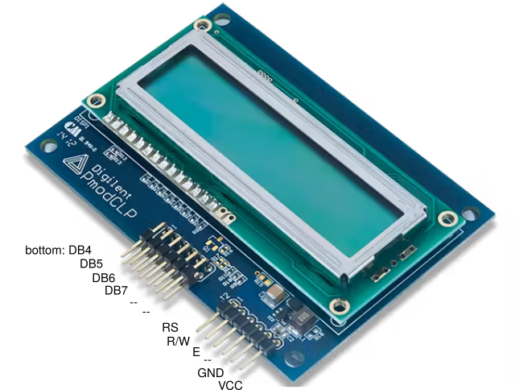

# Lab 4: LCD (Liquid Crystal Display)

* [Pre-Lab preparation](#preparation)
* [Part 1: LCD screen module](#part1)
* [Part 2: Class for HD44780 based LCDs](#part2)
* [Part 3: Stopwatch](#part3)
* [Challenges](#challenges)
* [References](#references)

### Component list
 
* ESP32 board with pre-installed MicroPython firmware, USB cable
* LCD module (such as Digilent PmodCLP)
* Jumper wires

   

### Learning objectives

After completing this lab you will be able to:

* Use alphanumeric LCD
* Understand the digital communication between MCU and HD44780
* Understand the ASCII table
* Use module functions for LCD in MicroPython
* Generate custom characters on LCD

The purpose of the laboratory exercise is to understand the serial control of Hitachi HD44780-based LCD character display and how to define custom characters. Another goal is to learn how to use Python's class methods in your own project.

<a name="preparation"></a>

## Pre-Lab preparation

1. Use reference manual of the [Digilent PmodCLP](https://digilent.com/reference/pmod/pmodclp/start)  module and find out the connection of LCD display. What data and control signals are used? What is the meaning of these signals?

   | **LCD signal(s)** | **PmodCLP pin(s)** | **Description** |
   | :-: | :-: | :-- |
   | RS | J2, pin 1 | Register selection signal. Selection between Instruction register (RS=0) and Data register (RS=1) |
   | R/W |  |  |
   | E |  |  |
   | D[3:0] |  |  |
   | D[7:4] |  |  |

2. What is the ASCII table? What are the codes/values for uppercase letters `A` to `E`, lowercase letters `a` to `e`, and numbers `0` to `4` in this table?

   | **Char** | **Decimal** | **Hexadecimal** |
   | :-: | :-: | :-: |
   | ... |  |  |
   | `0` | 48 | 0x30 |
   | `1` |  |  |
   | ... |  |  |
   | `A` | 65 | 0x41 |
   | `B` |  |  |
   | ... |  |  |
   | `a` | 97 | 0x61 |
   | `b` |  |  |
   | ... |  |  |

<a name="part1"></a>

## Part 1: LCD screen module

**LCD (Liquid Crystal Display)** is an electronic device which is used for display any ASCII text. There are many different screen sizes e.g. 16x1, 16x2, 16x4, 20x4, 40x4 characters and each character is made of 5x8 matrix pixel dots. LCD displays have different LED back-light in yellow-green, white and blue color. LCD modules are mostly available in COB (Chip-On-Board) type. With this method, the controller IC chip or driver (here: HD44780) is directly mounted on the backside of the LCD module itself.

The control is based on the Hitachi HD44780 chipset (or a compatible), which is found on most text-based LCDs, and hence the driving software remains the same even for different screen sizes. The driver contains instruction set, character set, and in addition you can also generate your own characters.

The HD44780 is capable of operating in 8-bit mode i.e. faster, but 11 microcontroller pins (8 data + 3 control) are needed. Because the speed is not really that important as the amount of data needed to drive the display is low, the 4-bit mode is more appropriate for microcontrollers since only 4+2=6 (or 4+3=7) pins are needed.

In 8-bit mode we send the command/data to the LCD using eight data lines (D0-D7), while in 4-bit mode we use four data lines (D4-D7) to send commands and data. Inside the HD44780 there is still an 8-bit operation so for 4-bit mode, two writes to get 8-bit quantity inside the chip are made (first high four bits and then low four bits with an E clock pulse).

In the lab, the Digilent PmodCLP display module is used. The display consists of 2 rows of 16 characters each. It does not provide a back-light and it communicates through a parallel interface with 4 data and 3 control wires.

* RS - register select. Selects the data or instruction register inside the HD44780
* E - enable. This loads the data into the HD44780 on the falling edge
* R/W - read or write operation
* D7:4 - Upper nibble used in 4-bit mode

When a command is given to LCD, the command register (RS = 0) is selected and when data is sent to LCD, the data register (RS = 1) is selected. A **command** is an instruction entered on the LCD in order to perform the required function. In order to display textual information, **data** is send to LCD.



1. Use breadboard, jumper wires, and connect LCD signals to ESP32 GPIO pins as follows: RS - GPIO 26, R/W - GND, E - GPIO 25, D7:4 - GPIO 27, 9, 10, 13, VCC - 3.3V, GND - GND.

   

<a name="part2"></a>

## Part 2: Class for HD44780 based LCDs

In the lab, we are using MicroPython module for HD44780-based LCDs developed by Shujen Chen et al. within book titled *Raspberry Pi Pico Interfacing and Programming with MicroPython* and modified by Tomas Fryza. The `LcdHdD44780` class provides the following methods:

   | **Method name** | **Parameters** | **Description** | **Example** |
   | :-- | :-- | :-- | :-- |
   | `LcdHd44780` | `rs`, `e`, and `d` pins | Constructor. Set GPIO pins for HD44780-based LCD and call the initialization sequence. (`rs`-Register Select, `e`-Enable, `d`-Data) | `LcdHd44780(rs=26, e=25, d=[13, 10, 9, 27])` |
   | `move_to` | `line`, `column` | Move cursor to a specified location of the display. `line` and `column` start from 1 | `move_to(1, 3)` |
   | `write` | `s` - string | Display a string (array of characters) on the LCD | `write("Using LCD...")` |
   | `custom_char` | `addr`, `charmap` | Write a character to one of the 8 CG RAM locations, available as `chr(0)` through `chr(7)` | `custom_char(0, bytearray([0x4, 0xa, 0xa, 0xa, 0x11, 0x1f, 0xe, 0x00]))` |
   | `command` | `cmd` - command | Write a command to the LCD controller, such as `0x01` to clear the display | `command(0x01)` |

1. In Thonny IDE, create a new file `lcd_hd44780.py` and copy/paste [module code](https://raw.githubusercontent.com/tomas-fryza/esp-micropython/main/solutions/05-display/lcd_hd44780.py) to it. To import and use the module, the copy of file must be stored in the ESP32 device as well.

2. Create a new file `01-test_lcd.py` and write a simple script to test `move_to` and `write` functions.

   ```python
   # Import necessary module(s)
   # From `lcd_hd4480.py` file import class `LcdHd4480`
   from lcd_hd44780 import LcdHd44780
   
   # Initialize LCD (four-data pins order is [D4, D5, D6, D7])
   lcd = LcdHd44780(rs=26, e=25, d=[13, 10, 9, 27])

   # Default screen
   lcd.move_to(1, 3)
   lcd.write("Using LCD...")

   try:
       while True:
           pass

   except KeyboardInterrupt:
       print("Ctrl+C Pressed. Exiting...")

       # Optional cleanup code
       lcd.command(0x01)  # Clear display
   ```

3. All LCD displays based on the Hitachi HD44780 controller have two types of memory that store defined characters: CGROM and CGRAM (Character Generator ROM & RAM). The CGROM memory is non-volatile and cannot be modified, while the CGRAM memory is volatile and can be [modified at any time](https://lastminuteengineers.com/arduino-1602-character-lcd-tutorial/).

   **CGROM** memory is used to store all permanent fonts that can be displayed using their ASCII code. For example, if we write 0x43, then we get the character "C" on the display. In total, it can generate 192 5x8 character patterns.

   

   CGRAM is another memory that can be used for storing user defined characters. This RAM is limited to 64 bytes. Meaning, for 5x8 pixel based LCD, up to 8 user-defined characters can be stored in the CGRAM. It is useful if you want to use a character that is not part of the standard 127-character ASCII table.

   A custom character is an array of 8 bytes. Each byte (only 5 bits are considered) in the array defines one row of the character in the 5x8 matrix. Whereas, the zeros and ones in the byte indicate which pixels in the row should be on and which ones should be off.

   Use [LCD pattern library](https://www.quinapalus.com/hd44780udg.html) and generate two 5 by 8 custom characters. Use the foíllowing structure to display them on the sceen.

   ```python
   ...
   # Initialize LCD (four-data pins order is [D4, D5, D6, D7])
   lcd = LcdHd44780(rs=26, e=25, d=[13, 10, 9, 27])

   # Set custom character(s)
   # https://www.quinapalus.com/hd44780udg.html
   new_char = bytearray([0x4, 0xa, 0xa, 0xa, 0x11, 0x1f, 0xe, 0x00])
   lcd.custom_char(0, new_char)

   # Create other custom characters
   # WRITE YOUR CODE HERE

   # Show new custom character
   lcd.move_to(2, 3)
   lcd.write(chr(0))

   # Show other custom characters
   # WRITE YOUR CODE HERE

   try:
       while True:
           pass
           ...
   ```

<a name="part3"></a>

## Part 3: Stopwatch

To display numerical values, they first need to be converted to strings.

   ```python
   # Example how to put a numeric value to display
   TEMP = 23.25
   TEMP_STR = str(TEMP)  # Convert to string
   TEMP_STR = TEMP_STR + chr(223) + "C"  # Add `°C` to the string
   lcd.move_to(2, 5)
   lcd.write(TEMP_STR)
   ```

2. Create a stopwatch counter according to the screenshot below. Use timer interrupt and update the stopwatch value every 100&nbsp;ms. Display tenths of a second only in the form `00:00.tenths`, ie let the stopwatch counts from `00:00.0` to `00:00.9` and then starts counting again.

   

   ```python
   # Import necessary modules
   from lcd_hd44780 import LcdHd44780
   from machine import Timer

   def stopwatch_100ms(t):
       """Interrupt handler of Timer0 executed every 100 millisecs"""
       global tenths  # Can use global variable here

       # Modify tenths of seconds
       # WRITE YOR CODE HERE

       # Display tenths of seconds
       # WRITE YOR CODE HERE

   # Initialize LCD (four-data pins order is [D4, D5, D6, D7])
   lcd = LcdHd44780(rs=26, e=25, d=[13, 10, 9, 27])

   # Default screen
   # WRITE YOR CODE HERE

   # Define 100-millisec timer
   timer0 = Timer(0)
   timer0.init(period=100,
               mode=Timer.PERIODIC,
               callback=stopwatch_100ms)

   tenths = 0  # Global variable for `tenths of seconds`

   try:
       while True:
           pass

   except KeyboardInterrupt:
       print("Ctrl+C Pressed. Exiting...")

       # Optional cleanup code
       lcd.command(0x01)  # Clear display
       timer0.deinit()    # Deinitialize the timer
   ```

2. Complete the stopwatch counter by seconds and minutes. Let the stopwatch counts from `00:00.0` to `59:59.9` and then starts again.

<a name="challenges"></a>

## Challenges

1. Add a push button to your application to pause and resume counting when the button is pressed. When the counter is paused, bllink the current stopwatch value.

2. Create six new characters in the CG RAM of the LCD controller and program a progress bar at several columns of the LCD. Determine how often the progress bar should be updated to accurately represent one second of progress.

   

   > **NOTE:** An explanation and instructions on how to program such a progress bar can be found [here (for C language)](https://www.youtube.com/watch?app=desktop&v=rKP1AA-hizw).

<a name="references"></a>

## References

1. Digilent. [Pmod CLP. Character LCD with Parallel Interface](https://digilent.com/reference/pmod/pmodclp/start)

2. Last Minute Enginners. [Interfacing 16×2 Character LCD Module with Arduino](https://lastminuteengineers.com/arduino-1602-character-lcd-tutorial/)

3. Quinapalus. [LCD pattern library](https://www.quinapalus.com/hd44780udg.html)

4. [LCd Display Screenshot Generator](http://avtanski.net/projects/lcd/)

5. eTech Tom. [Arduino Progress Bar Graph Tutorial](https://www.youtube.com/watch?app=desktop&v=rKP1AA-hizw)

6. Raspberry Pi Spy. [16x2 LCD Module Control Using Python](https://www.raspberrypi-spy.co.uk/2012/07/16x2-lcd-module-control-using-python/)
