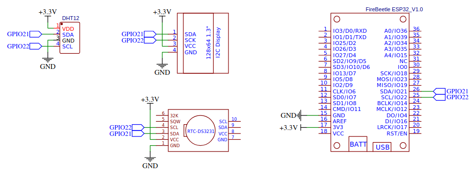

# Lab 7: Wi-Fi communication

* [Pre-Lab preparation](#preparation)
* [Part 1: Wi-Fi scan](#part1)
* [Part 2: Wi-Fi Station mode](#part2)
* [Part 4: Requests](#part3)
* [Part 4: ThingSpeak online platform](#part4)
* [Challenges](#challenges)
* [References](#references)

### Component list
 
* ESP32 board with pre-installed MicroPython firmware, USB cable
* Breadboard
* DHT12 humidity/temperature sensor
* Jumper wires

### Learning objectives

* Understand the Wi-Fi STA mode
* Use methods for connecting and disconnecting the Wi-Fi
* Perform data transfers between ESP32 and server via GET and POST requests

<a name="preparation"></a>

## Pre-Lab preparation

1. Complete the tasks from the previous lab (getting data from I2C sensors).

2. Create an account on the [ThingSpeak](https://thingspeak.mathworks.com/) IoT platform and optionally also on [OpenWeatherMap](https://openweathermap.org/) server for weather data.

3. Explore the usage of the `urequests` or `requests` library in MicroPython. Understand how to make HTTP requests and handle responses.

<a name="part1"></a>

## Part 1: Wi-Fi scan

The Wi-Fi scanning process on the ESP32 involves searching for available Wi-Fi networks in the vicinity. This is commonly used to provide information about nearby networks or to allow the ESP32 to connect to a specific Wi-Fi network.


1. Ensure your ESP32 board is connected to your computer via a USB cable. Open the Thonny IDE and set the interpreter to `ESP32`. You can click the red **Stop/Restart** button or press the on-board reset button if necessary to reset the board.

2. Create a new file `wifi-scan.py` in Thonny and create an instance of the `WLAN` class from the `network` module, specifying the desired Station mode, activate the Wi-Fi interface, and perform the Wi-Fi scan.

   ```python
   import network

   # Initialize the Wi-Fi interface in Station mode and activate it
   wifi = network.WLAN(network.STA_IF)
   wifi.active(True)

   # Perform the Wi-Fi scan
   print("Scanning Wi-Fi networks... ", end="")
   nets = wifi.scan()
   print(f"{len(nets)} network(s) found.")

   # Print the list of available Wi-Fi networks
   print("RSSI\tChannel\tSSID")
   for net in nets:
       rssi = net[3]  # Signal strength
       channel = net[2]  # Channel number
       ssid = net[0].decode("utf-8")  # SSID (network name)
       print(f"{rssi}\t(ch.{channel})\t{ssid}")
   ```

   > **Note:** The `.decode("utf-8")` method converts a sequence of bytes into a string using the UTF-8 encoding.

3. See the documentation for [WLAN class](https://docs.micropython.org/en/latest/library/network.WLAN.html) description.

<a name="part2"></a>

## Part 2: Wi-Fi Station mode

ESP32 microcontrollers typically have two main modes of operation for the Wi-Fi interface: Station mode and Access Point mode.

In **Station Mode (`network.STA_IF`)** the ESP32 connects to an existing Wi-Fi network as a client. It can obtain an IP address from the network and access the Internet. This mode is suitable for scenarios where the ESP32 needs to connect to an existing Wi-Fi network, like a home or office network.


In **Access Point mode (`network.AP_IF`)** the ESP32 acts as a Wi-Fi access point (AP) and other devices (like smartphones or computers) can connect to the ESP32 and obtain an IP address. This mode is useful when you want the ESP32 to create its own Wi-Fi network.


The Wi-Fi modes can be activated or deactivated using the `active()` method of the `network` module. These modes can be used individually or in combination. For example, the ESP32 can operate in both Station and Access Point modes simultaneously (`network.WIFI_AP_STA`), allowing it to connect to an existing Wi-Fi network while also providing an access point for other devices.

1. In Thonny, create a new `config.py` file, set the Wi-Fi credentions, and save it on the ESP32 device.

   ```python
   SSID = "YOUR_WIFI_SSID"
   PSWD = "YOUR_WIFI_PASSWORD"
   ```

2. Create a new file `wifi_utils.py` and [copy/paste the functions](https://raw.githubusercontent.com/tomas-fryza/esp-micropython/refs/heads/main/modules/wifi_utils.py) to connect and disconnect the Wi-Fi network. Save this file on the ESP32 device as well.

   See the [Sphinx documentation](https://tomas-fryza.github.io/esp-micropython/modules/wifi.html) for this module.

3. Create a new file `wifi-sta.py` and use the following template to connect and disconnect the network.

   ```python
   import network
   import wifi_utils
   import config

   # Initialize the Wi-Fi interface in Station mode
   wifi = network.WLAN(network.STA_IF)

   # Connect to SSID
   wifi_utils.connect(wifi, config.SSID, config.PSWD)
   # Get the current IP-level network-interface parameters
   print("     IP               MASK            GATEWAY          DNS")
   print(wifi.ifconfig())


   # WRITE YOUR CODE HERE


   print(f"Is connected? {wifi.isconnected()}")
   wifi_utils.disconnect(wifi)
   print(f"Is connected? {wifi.isconnected()}")
   ```

   When working with the `network.WLAN` class, the `ifconfig()` is used to get or set the IP configuration of the interface.

<!--
4. Using the `WLAN.status()` method, we get the [current status](https://docs.micropython.org/en/latest/library/network.WLAN.html) of the wireless connection.

   ```python
   print(wifi.status())
   ```

   | **Status #** | **Status name** | **Description** |
   | :-: | :-- | :-- |
   | `1000` | `STAT_IDLE` | There is no connection or activity |
   | `1001` | `STAT_CONNECTING` | Connecting in progress |
   | `1010` | `STAT_GOT_IP` | The network is successfully connected and the IP is obtained |
   | `201` | `STAT_NO_AP_FOUND` | The network connection failed because no access point replied |
   | `202` | `STAT_WRONG_PASSWORD` | The network connection failed due to incorrect password |
   | `203` | `STAT_ASSOC_FAIL` | The network connection failed due to another reason |

   For the station object, the method can be called with the `rssi` argument, which returns the Received Signal Strength Indicator (RSSI) in dBm for the given access point.

   ```python
   print(wifi.status("rssi"))
   ```
-->

4. Using the `WLAN.config()` method, we get or set general network interface parameters. This method allow to work with additional parameters, which include network-specific and hardware-specific parameters according to the table.

   | **Parameter** | **Description** | **Type** |
   | :-- | :-- | :-- |
   | `mac` | MAC address | bytes |
   | `ssid` | WiFi access point name | string |
   | `channel` | WiFi channel | integer |
   | `hidden` | Whether SSID is hidden (for AP mode only) | boolean |
   | `security` | Security protocol supported (for AP mode only) | enumeration |
   | `hostname` | The hostname that will be sent to DHCP (STA interfaces) | string |
   | `reconnects` | Number of reconnect attempts to make | integer, 0=none, -1=unlimited |
   | `txpower` | Maximum transmit power in dBm | integer or float |

   ```python
   prm = wifi.config("mac")
   print("MAC address:", ':'.join([f"{b:02x}" for b in prm]))
   ```

   Try other parameters from the table.

7. In case of STA mode, method `WLAN.isconnected()` returns `True` if connected to a WiFi access point and has a valid IP address. In AP mode returns `True` when a station is connected.

   ```python
   print(f"Is connected? {wifi.isconnected()}")
   ```

<a name="part3"></a>

## Part 3: Requests

The **GET** and **POST** methods are two fundamental types of HTTP request methods used in web development and APIs to facilitate communication between clients (like web browsers or IoT devices) and servers.

**GET Request:**
   * Use GET requests when you want to send or get data as part of the URL.
   * Data is appended to the URL as query parameters.
   * GET requests are generally simpler to implement, especially for basic projects.
   * They can be easier to debug and test since you can see the data in the URL.

**POST Request:**
   * Use POST requests when you have more data to send or when sending sensitive data (as it's not exposed in the URL).
   * Data is sent in the body of the HTTP request.
   * POST requests can accommodate larger payloads.

| **Feature** | **GET Method** | **POST Method** |
| :-- | :-- | :-- |
| **Purpose** | Retrieve data from a server | Send data to a server for processing |
| **Data Retrieval** | Fetches resource representations | Submits data for server-side processing |
| **Data Transmission** | Data sent in the URL as query parameters | Data sent in the body of the request |
| **Data Size Limit** | Limited by URL length (typically around 2048 characters) | Generally larger, limited by server settings |
| **Visibility** | Data visible in the URL, not secure for sensitive info | Data not visible in the URL, more secure |
| **Caching** | Can be cached by browsers and proxies | Typically not cached |
| **Browser History** | Remains in browser history | Does not remain in browser history |
| **Use Cases** | Fetching data, querying resources, searching | Submitting forms, uploading files, creating resources |
| **Response Type** | Often returns data (e.g., HTML, JSON) | Typically returns a confirmation or status message |

In MicroPython, especially when using the `urequests` library for handling HTTP requests, there are several response methods and parameters that you can use to interact with the response object. Here is a list of common response methods and attributes:

   | Attribute/Method | Description |
   | :-- | :-- |
   | **status_code** | The HTTP status code returned by the server (e.g., 200, 404). |
   | **reason** | A textual description of the HTTP status code (e.g., "OK"). |
   | **text** | The response body as a string. |
   | **content** | The response body as bytes, useful for binary data. |
   | **headers** | A dictionary of the HTTP headers returned by the server. |
   | **close()** | Closes the response to free up resources. |

1. Add the following lines to the script from the previous part and test the GET type of requests.

   ```python
   ...
   import urequests  # Network Request Module

   ...
   print("----- GET request -----")
   # Uniform Resource Locator -- A specific address used to access resources on the internet
   url = "http://api.open-notify.org/iss-now.json"
   response = urequests.get(url)

   print("GET status code: ", end="")
   print(response.status_code)
   print("GET text:")
   print(response.text)
   
   # Close the response to free up resources
   response.close()
   ...
   ```

   Print other response attributes and other request APIs:
      - Current ISS positions: http://api.open-notify.org/iss-now.json
      - List of astronauts in space: http://api.open-notify.org/astros.json
      - Current weather in Brno: https://api.open-meteo.com/v1/forecast?latitude=49.19522&longitude=16.60796&current_weather=true
      - Sunrise, Sunset in Brno: https://suntracker.freeapi.me/?lat=49.19522&lon=16.60796
      - Euro to Czech Koruna conversion: https://hexarate.paikama.co/api/rates/latest/EUR?target=CZK
      - CoinGecko API (bitcoin EUR price): https://api.coingecko.com/api/v3/simple/price?ids=bitcoin&vs_currencies=eur
      - Cat fact API: https://catfact.ninja/fact
      - Joke API: https://v2.jokeapi.dev/joke/Programming
      - Time API: https://timeapi.io/api/time/current/zone?timeZone=Europe/Prague
      - Anagram solver: https://anagram.freeapi.me/
      - Random facts: https://f-api.ir/api/facts/random
      - Random facts: https://uselessfacts.jsph.pl/api/v2/facts/random?language=en

2. Test the POST request as well.

   ```python
   ...
   print("----- POST request -----")
   url = "https://api.mathjs.org/v4/"
   payload = {"expr": ["2+2", "sqrt(2)", "sin(pi/2)"]}
   headers = {"Content-Type": "application/json"}
   response = urequests.post(url, json=payload, headers=headers)

   print("POST status code: ", end="")
   print(response.status_code)
   print("POST text:")
   print(response.text)
   response.close()
   ...
   ```

   Some important notes:

      * The list and description of all GET/POST methods for TimeAPI is listed [here](https://timeapi.io/swagger/index.html).
      * The common HTTP response status codes consists of (the complete list is [here](https://developer.mozilla.org/en-US/docs/Web/HTTP/Status)):
         * **100 Continue**: The server has received the request headers and the client should proceed to send the request body.
         * **200 OK**: The request has succeeded.
         * **301 Moved Permanently**: The requested resource has been moved permanently to a new URL.
         * **404 Not Found**: The server cannot find the requested resource.

<a name="part4"></a>

## Part 4: ThingSpeak online platform

ThingSpeak is an Internet of Things (IoT) platform that allows you to collect, analyze, and visualize data from your connected devices. It provides APIs for storing and retrieving data, making it easy to integrate IoT devices into your projects. One common use case for ThingSpeak is to store and display sensor data. Note that, ThingSpeak supports both, GET and POST types of HTTP request methods.

1. Use breadboard, jumper wires, and connect I2C [DHT12](../manuals/dht12_manual.pdf) sensor to ESP32 GPIO pins as follows: SDA - GPIO 21, SCL - GPIO 22, VCC - 3.3V, GND - GND.

   > **Note:** Connect the components on the breadboard only when the supply voltage/USB is disconnected! There is no need to connect external pull-up resistors on the SDA and SCL pins, because the internal ones is used.

   

2. Create a ThingSpeak Account: If you don't have a ThingSpeak account, get started for free at [ThingSpeak](https://thingspeak.mathworks.com/).

3. Create a Channel: After logging in, create a new channel. A channel is where you will store your sensor data and you can create up to four channels.

4. Get Channel API Key: In your channel settings, you'll find an Write API Key. This key is used to authenticate your device when sending data to ThingSpeak.

5. Use [`dht12.py`](../modules/dht12.py) file from the previous lab and save a copy of this file to the MicroPython device. See the [Sphinx documentation](https://tomas-fryza.github.io/esp-micropython/modules/dht12.html) for this class.

6. Write a MicroPython script that reads data from the DHT12 sensor and sends it to ThingSpeak. Use the `urequests` library to make HTTP requests.

   ```python
   from machine import I2C, Pin
   import dht12
   import network
   import wifi_utils
   import config
   import urequests
   import time

   API_KEY = "THINGSPEAK_WRITE_API_KEY"


   def send_to_thingspeak(temp, humidity):
       API_URL = "https://api.thingspeak.com/update"

       # GET request
       url = f"{API_URL}?api_key={API_KEY}&field1={temp}&field2={humidity}"
       response = urequests.get(url)

       print(f"Entry # sent to ThingSpeak: {response.text}")
       response.close()


   # Connect to the DHT12 sensor
   i2c = I2C(0, scl=Pin(22), sda=Pin(21), freq=400_000)
   sensor = dht12.DHT12(i2c)

   # Create Station interface
   wifi = network.WLAN(network.STA_IF)
   print("Start using Wi-Fi. Press `Ctrl+C` to stop")

   try:
       # Forever loop
       while True:
           temp, humidity = sensor.read_values()
           print(f"Temperature: {temp}°C, Humidity: {humidity}%")

           wifi_utils.connect(wifi, config.SSID, config.PSWD)
           send_to_thingspeak(temp, humidity)
           wifi_utils.disconnect(wifi)

           time.sleep(60)

   except KeyboardInterrupt:
       # This part runs when Ctrl+C is pressed
       print("Program stopped. Exiting...")

       # Optional cleanup code
       wifi_utils.disconnect(wifi)
   ```

   Note that, you can also use the POST request instead of the GET one.

   ```python
   ...
   # POST request
   url = f"{API_URL}?api_key={API_KEY}"
   payload = {"field1": temp, "field2": humidity}
   headers = {"Content-Type": "application/json"}
   response = urequests.post(url, json=payload, headers=headers)
   ...
   ```

7. Go to your ThingSpeak channel to view the data being sent by the ESP32.

<a name="challenges"></a>

## Challenges

1. The Network Time Protocol (NTP) is a protocol designed to synchronize the clocks of computers over a network with Coordinated Universal Time (UTC). NTP follows a client-server model, with clients requesting time information from servers and adjusting their local clocks based on the received server information.

   ```python
   from machine import RTC
   import network
   import wifi_utils
   import config
   import ntptime

   TIMEZONE_OFFSET = 1  # UTC+1:00 for CET (Central European Time)
                        # UTC+2:00 for CEST (Central European Summer Time)

   # Create Station interface
   wifi = network.WLAN(network.STA_IF)
   wifi_utils.connect(wifi, config.SSID, config.PSWD)

   # Get UTC time from NTP server and set it to RTC
   ntptime.host = "cz.pool.ntp.org"
   ntptime.settime()
   print("Local RTC synchronized")
   wifi_utils.disconnect(wifi)

   # Create an independent clock object
   rtc = RTC()

   print("UTC time after NTP update:")
   print(rtc.datetime())
   (year, month, day, wday, hrs, mins, secs, subsecs) = rtc.datetime()
   print("Update timezone:")
   rtc.init((year, month, day, wday, hrs+TIMEZONE_OFFSET, mins, secs, subsecs))
   print(rtc.datetime())


   # WRITE YOUR CODE HERE

    ```

   Add a forever loop, retrieve data from the local Real-Time Clock (RTC), ie. without the Wi-Fi connection, and display the information in a formatted manner, such as `yyyy-mm-dd hh:mm:ss`.

2. Create a functional weather monitoring system. The primary goal is to establish a Wi-Fi connection, access real-time weather data from the [OpenWeatherMap API](https://openweathermap.org/current), and display the information to the shell or on a local OLED screen. You need to have an account at OpenWeather service to get the data.

3. Search the online tutorial and examples and implement a simple web server on the ESP32 that responds to HTTP requests. Explore handling different types of requests, such as GET and POST, and responding with various types of content, like HTML pages or JSON data.

<a name="references"></a>

## References

1. Engineers Garage. [How to use MicroPython with ESP8266 and ESP32 to connect to a WiFi network](https://www.engineersgarage.com/micropython-wifi-network-esp8266-esp32/)

2. MicroPython. [class WLAN – control built-in WiFi interfaces](https://docs.micropython.org/en/latest/library/network.WLAN.html)

3. [ThingSpeak](https://thingspeak.mathworks.com/)

4. [OpenWeather](https://openweathermap.org/)

5. Mozilla Corporation. [HTTP response status codes](https://developer.mozilla.org/en-US/docs/Web/HTTP/Status)

6. FreeAPI.me. [Simple, Reliable APIs for Everyone](https://freeapi.me/)

7. ADGStudios. [Free Historical Stocks API](https://stocks.adgstudios.co.za/)
