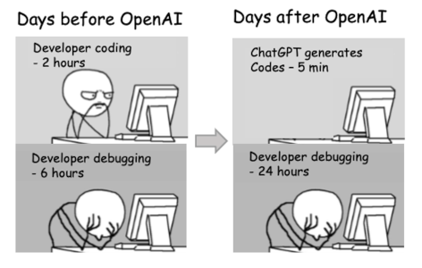

# Student team project guidelines: Micropython-code projects 2025/26

## Overview

Student teams (3-4 students) will design and develop an ESP32-based system to address a selected problem or application area. The project will be completed in three phases: **Design**, **Build**, and **Demonstration**.

* Students solve the project in the laboratory according to the course schedule.

* The code must be written in MicroPython and must be implementable on an ESP32 FireBeetle board.

* If needed, use the simulation tools, such as [wokwi](https://wokwi.com/), [Falstad](https://www.falstad.com/circuit/circuitjs.html), etc.

* Use modules/classes from the labs. Create your own (and documentation in Sphinx) for the new components. Strictly follow licenses for third-party libraries!

* Follow coding standards in your codes.

---

## Phase 1: Design (Project proposal)

### Objective
Plan, design, and justify your project idea before implementation.

### Deliverable
A **public [GitHub](https://github.com/)** repository for your project includes:

1. **Problem statement and solution overview**
   - Clearly describe the problem being addressed.
   - Explain how your proposed solution uses MCU to solve it.

2. **List of hardware components**
   - Provide a list of sensors, actuators, and other electronic components intended for use.
   - Include justification for your component choices (why each part is needed).

3. **Software design**
   - Present system-level **block diagrams**, **flowcharts**, or **pseudocode** showing the planned software logic and control flow.

---

## Phase 2: Build (Prototype development)

### Objective
Implement and test a working prototype based on your approved proposal.

### Notes
- Teams may use university laboratories and facilities for hardware assembly.
- Circuit construction may include passive and active components on a breadboard or custom PCB (if available).

### Deliverables

1. **Prototype demonstration video**
   - A **maximum 3-minute video** showing the prototype's functionality.
   - Clearly explain the system's features, operation, and performance.

2. **Source code submission**
   - Submit well-documented MicroPython code to GitHub.
   - Highlight key functions, algorithms, and any custom libraries used.

3. **Technical documentation**
   - Include **block diagrams**, **circuit schematics**, and **justifications** for major design choices (hardware and software).

4. **Pitch poster (A3 or larger)**
   - A visually appealing poster summarizing:
     - Project concept and motivation
     - System design and functionality
     - Value, applications, and potential impact

---

## Phase 3: Demonstration

### Objective
Present and defend your project in front of instructors and peers.

### Expectations
- Teams will **showcase their working prototype** and **poster** during the demonstration session.
- Each member should be prepared to explain their contribution and answer technical questions about the design, implementation, and testing.

   

---

## Topics 2025/26 (for BPA-DE2 only)

> **Note:** Students from MPA-DIE enroll and complete a free online course [Introduction to Embedded Machine Learning](https://www.coursera.org/learn/introduction-to-embedded-machine-learning) and propose their own project topic. Use the [Edge Impulse](https://edgeimpulse.com/) tool for the project.

### 1. Indoor air quality monitoring system
Measure temperature, humidity, CO2, and particulate matter (PM2.5/PM10) using sensors such as DHTx, MQx, SQP4x, SDS011, etc. Display data on a display and send it to a web dashboard.

### 2. FM radio receiver with digital tuning
Build an FM receiver using a tuner module (e.g., Si4703). Include a display to show frequency and simple buttons for tuning. Consider an RDS (Radio Data System).

### 3. Portable environmental data logger with timestamping
Collect and store environmental data (temperature, pressure, light, motion, etc.) to an SD card or internal memory. Include a real-time clock for timestamping. Export data to computer.

### 4. Audio spectrum analyzer
Build a real-time audio spectrum analyzer using a microphone. Use a Fast Fourier Transform (FFT) to convert audio signals into a frequency spectrum and display the results on an OLED screen. Optionally, data could be logged to an SD card for analysis.
