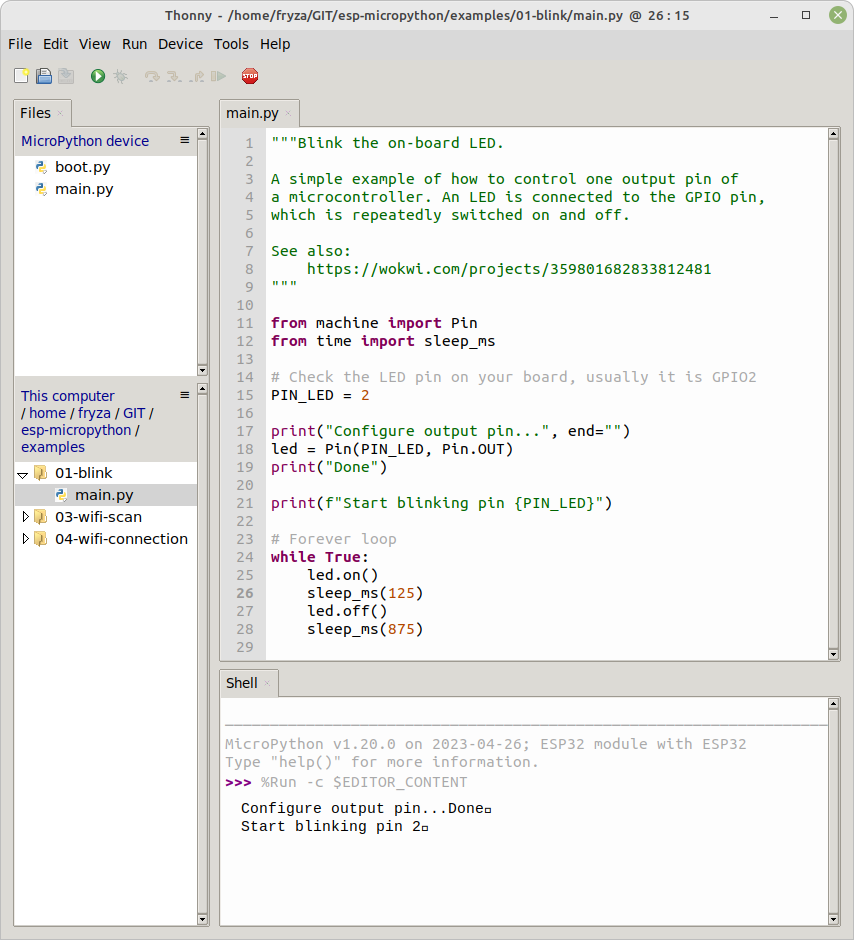

# Lab 1: Programming in MicroPython

### Learning objectives

After completing this lab you will be able to:

* Understand what MicroPython is and how it differs from traditional Python
* Use the tools and software for MicroPython development
* Use the MicroPython REPL to interact with the microcontroller in real-time
* Execute basic Python commands on the microcontroller
* Control GPIO pin to turn on/off LED

The purpose of this laboratory exercise is to provide a foundational understanding of MicroPython and hands-on experience with microcontroller programming.

### Table of contents

* [Pre-Lab preparation](#preparation)
* [Part 1: Wokwi simulator](#part1)
* [Part 2: Thonny IDE](#part2)
* [Part 3: Wi-Fi scanner](#part3)
* [(Optional) Experiments on your own](#experiments)
* [References](#references)

### Components list

* ESP32 board, USB cable

<a name="preparation"></a>

## Pre-Lab preparation

1. (Optional) If you have option to use ESP32 board and logic analyzer, download and install [Saleae Logic 1](https://support.saleae.com/logic-software/legacy-software/older-software-releases#logic-1-x-download-links).

<a name="part1"></a>

## Part 1: Wokwi simulator

Wokwi is a web-based platform for simulating and visualizing electronics projects right in your web browser. You can use it to simulate Arduino, ESP32, STM32, and many other popular boards, parts and sensors in C, MicroPython or Rust language.

1. Open your web browser, visit the [Wokwi](https://wokwi.com/micropython) website, and select **ESP32 Blink** starter template. Wokwi provides a work area with the circuit on the right where you can add and connect components like LEDs, sensors, or other peripherals and a code editor on the left. Here, you can write MicroPython code that will run on the virtual ESP32 microcontroller.

   

2. The Blink template consists of ESP32 microcontroller, LED, and resistor. Simulate the circuit by clicking on a **Star the simulation** button. This will start the simulation, and you will see how your code interacts with the virtual components.

3. Go through each line of the source code and clarify its function. Change the duration of the `sleep()`` function and observe the changes during simulation.

4. Incorporate an additional LED and resistor into the circuit, designate an available GPIO pin, establish the LED connection using an active-low configuration, and develop the code to achieve alternating blinking of two LEDs.

<a name="part2"></a>

## Part 2: Thonny IDE

Thonny is an integrated development environment (IDE) designed primarily for Python programming. It provides a user-friendly and beginner-friendly environment for writing, running, and debugging Python code. It can also be used with MicroPython for programming microcontrollers like the ESP8266 and ESP32. Thonny is available for multiple platforms, including Windows, macOS, and Linux.

1. Use micro USB cable and connect the ESP32 board to your computer Run Thonny IDE and select on-board interpreter. Go to **Run > Select interpreter... > Interpreter** and select `ESP32` or `ESP8266`. Click on red **Stop/Restart** button or press the on-board reset button if necesary.

2. In MicroPython programming, REPL stands for `Read-Eval-Print Loop`. It is an interactive mode that allows you to enter and execute Python code commands directly, one at a time, without the need to write and upload entire scripts or programs. Use the following commands in **Shell**.

    ```python
    # Print string to a Shell
    >>> print("Hi there!")
    Hi there!

    # Operators used for the different functions like division,
    # multiplication, addition, subtraction, ...
    >>> 10/3
    3.333333
    >>> 10//3
    3
    >>> 10%3
    1
    >>> 10*3
    30
    >>> 10**3
    1000
    >>> pi = 3.1415
    >>> print(pi)
    3.1415
    ```

    See MicroPython tutorials, such as [MicroPython Programming Basics with ESP32 and ESP8266](https://randomnerdtutorials.com/micropython-programming-basics-esp32-esp8266/) for detailed explanation.

    Test some other useful commands from [Quick reference for the ESP32](https://docs.micropython.org/en/latest/esp32/quickref.html):

    ```python
    # A platform identifier
    >>> import sys
    >>> sys.platform
    'esp32'

    # Get the current frequency of the CPU and RTC time
    >>> import machine
    >>> help(machine)
    >>> machine.freq()
    >>> machine.RTC().datetime()

    # Get Flash size in Bytes
    >>> import esp
    >>> esp.flash_size()

    # Read the internal temperature (in Fahrenheit)
    >>> import esp32
    >>> esp32.raw_temperature()
    # FYI: temp_c = (temp_f-32) * (5/9)
    #      temp_f = temp_c * (9/5) + 32
    ```

    Write code to read the ESP core temperature and print it in both Fahrenheit and Celsius.

3. In Thonny IDE, create a new source file in menu **File > New Ctrl+N**, copy/paste the [example blink](https://raw.githubusercontent.com/tomas-fryza/esp-micropython/main/examples/01-blink/main.py) code and run the application by **Run > Run current script F5**. Save the code as `01-blink.py` to your local folder.

   

<a name="part3"></a>

## Part 3: Wi-Fi scanner

Because ESP32 microcontroller consists of Wi-Fi module, you can use MicroPython's `network` module to perform a simple Wi-Fi scan.

1. In Thonny IDE, create a new source file in menu **File > New Ctrl+N**, copy/paste the [example](https://raw.githubusercontent.com/tomas-fryza/esp-micropython/main/examples/03-wifi-scan/main.py) code and run the application. Save the code as `01-wifi-scan.py` to your local folder.

    ```python
    import network

    wlan = network.WLAN(network.STA_IF)  # Initialize the WLAN (Station mode)
    wlan.active(True)  # Activate the WLAN interface

    # Perform the Wi-Fi scan
    available_networks = wlan.scan()

    # Print the list of available Wi-Fi networks
    for network in available_networks:
        print("SSID:", network[0].decode("utf-8"))
        print("Signal Strength (dBm):", network[3])
    ```

    This code initializes the WLAN interface in Station mode, performs a Wi-Fi scan, and then prints the SSID and signal strength (in dBm) of each available network.

2. Start a new access point on your smartphone and repeat the application. Try several distances between the phone and ESP32 board and observe the RSSI parameter.

<a name="experiments"></a>

## (Optional) Experiments on your own

1. Modify the Wokwi example and build an application that will repeatedly trasnmit the string `PARIS` on a LED in the Morse code. Choose the duration of "dot" and "dash" so that they are visible during the simulation and/or implementation. Note that the proper Morse code timing is explained [here](https://morsecode.world/international/timing.html).

2. If you have your own ESP32/ESP8266 board, follow the [instructions](https://github.com/tomas-fryza/esp-micropython/wiki/How-to-use-MicroPython-and-ESP32-ESP8266) and install the MicroPython interpreter on it.

<a name="references"></a>

## References

1. [Getting started with MicroPython on the ESP32](https://docs.micropython.org/en/latest/esp32/tutorial/intro.html)

2. MicroPython Documentation. [Quick reference for the ESP32](https://docs.micropython.org/en/latest/esp32/quickref.html)

3. Stephen C. Phillips. [Morse Code Timing](https://morsecode.world/international/timing.html)
