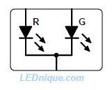
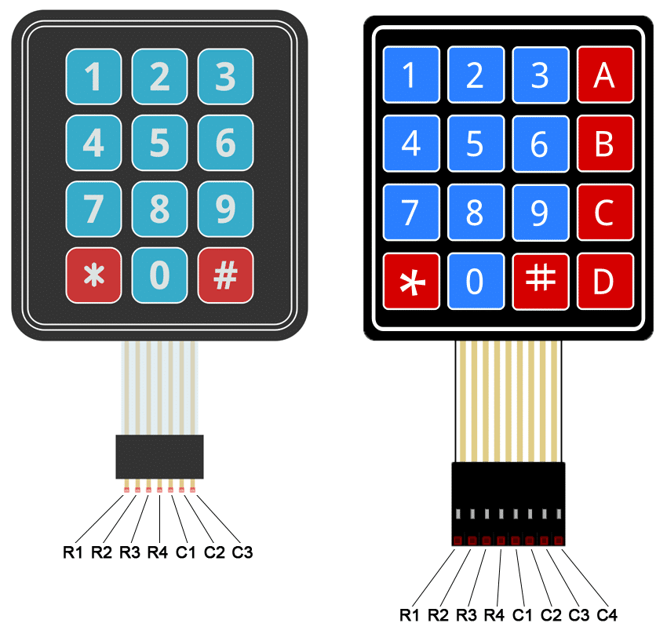

# Lab 3: Control of GPIO pins

### Learning objectives

After completing this lab you will be able to:

* Use a breadboard for prototyping
* Configure input/output pins of ESP32
* Understand the distinction between active-low and active-high connections
* Utilize basic I/O components, such as buttons, LEDs, and keypads, in MicroPython

The purpose of this laboratory exercise is to acquire the skills to interact with fundamental I/O devices using the GPIO (General Purpose Input/Output) pins of the ESP32 microcontroller.

### Table of contents

* [Pre-Lab preparation](#preparation)
* [Part 1: ESP32 pinout and Breadboards](#part1)
* [Part 2: Push button and LEDs](#part2)
* [Part 3: Matrix keypad](#part3)
* [(Optional) Experiments on your own](#experiments)
* [References](#references)

### Components list

* ESP32 board, USB cable
* Breadboard
* Push button
* 3 LEDs, 3 resistors
* 4x4 matrix keypad
* Jumper wires

<a name="preparation"></a>

## Pre-Lab preparation

1. Ensure you have a basic understanding of electronic components, including resistors, LEDs, buttons, as well as concepts like voltage, current, and digital input/output.

2. Remind yourself how to write and run MicroPython code on the ESP32 microcontroller. This includes knowledge of variables, loops, functions, and input/outputs.

<a name="part1"></a>

## Part 1: ESP32 pinout and Breadboards

The ESP32 microcontroller board has a number of **GPIO (General Purpose Input/Output) pins** that can be used for various purposes, such as digital input and output, analog input, communication interfaces (e.g., UART, SPI, I2C), PWM (Pulse Width Modulation) output, and more. The exact pinout may vary depending on the specific development board or module you are using. Here is the pinout for Firebeetle ESP32 board used in the lab:

   

Please note that we will use the numerical designations from the labels in light blue to interact with the GPIO pins in MicroPython. For example, we will refer to pins like 3, 1, 25, and so on, for the pins on the left side from the top.

The primary purpose of a **breadboard** (also known as a protoboard or solderless breadboard) is to facilitate the construction and testing of electronic circuits. It allows students to create complex circuits without soldering components together. This is especially important for beginners who are learning electronics and want to experiment with different designs because components can be easily inserted and removed, making it an ideal platform for prototyping and trying out various circuit configurations quickly. Also, breadboards provide a clear visual representation of the circuit layout.

A typical breadboard has rows and columns of interconnected metal clips or sockets, forming a grid. Most breadboards are divided into two halves, usually denoted as the "top" and "bottom" sections. Along the sides of the breadboard, there are usually two long strips, often colored red and blue, which are called the *power rails* used to provide power to your circuits. The red rail is for the positive supply voltage (VCC), and the blue rail is for ground (GND).

The main grid consists of multiple rows and columns. Each row typically contains five interconnected sockets, labeled A, B, C, D, and E. Each column contains interconnected sockets, and columns are often labeled with numbers (1-30, for example). The five sockets within a row are electrically connected. The same goes for sockets within a column; they are electrically connected. The points where the rows and columns intersect are where you can insert and connect components. For example, inserting a wire or component lead into a socket in row "A" and another in column "5" will create an electrical connection between them. For other details see [this](https://computers.tutsplus.com/tutorials/how-to-use-a-breadboard-and-build-a-led-circuit--mac-54746) breadboard description or [that one](https://www.sciencebuddies.org/science-fair-projects/references/how-to-use-a-breadboard).

   

<a name="part2"></a>

## Part 2: Push button and LEDs

Active-low and active-high are two different methods of connecting and controlling electronic components, such as LEDs (Light Emitting Diodes) and buttons, to an ESP32 GPIO pin. These methods determine the logic levels required to activate (turn on) or deactivate (turn off) the component. 

In an **active-low** configuration, the component is activated or considered "on" when the GPIO pin is at a logic LOW (0V or GND) state. When the GPIO pin transitions to a logic HIGH state (3.3V or VCC), the component is turned off.

In an **active-high** configuration, the component is activated when the GPIO pin is at a logic HIGH (3.3V or VCC) state. When the GPIO pin transitions to a logic LOW state (0V or GND), the component is turned off.

### Buttons

For an active-low button:

* The GPIO pin is connected to one terminal of the button.
* The other terminal is connected to GND.
* The internal (or external) pull-up resistor must be used.
* The button is considered pressed when the GPIO pin reads LOW (0).

For an active-high button:

* The GPIO pin is connected to one terminal of the button.
* The other terminal is connected to VCC (3.3V).
* The internal (or external) pull-down resistor must be used.
* The button is considered pressed when the GPIO pin reads HIGH (1).

   

   Note that, the ESP32 has built-in pull-up and pull-down resistors that can be enabled in software.

   ```python
   from machine import Pin

   # Create Pin objects for the GPIO pins
   button1 = Pin(14, Pin.IN, Pin.PULL_UP)  # Assuming GPIO 14

   button2 = Pin(26, Pin.IN, Pin.PULL_DOWN)

   ```

1. Use breadboard, jumper wires and connect one push button to ESP32 GPIO pin in active-low way. Use GPIO pin number 26.

2. Use micro USB cable and connect the ESP32 board to your computer. Run Thonny IDE and check if selected interpreter is Micropython (ESP32). If not, go to menu **Run > Select interpreter... > Interpreter** and select `ESP32` or `ESP8266`. Click on red **Stop/Restart** button or press the on-board reset button if necesary.

3. In Thonny IDE, create a new source file in menu **File > New Ctrl+N**, write the code, save the file as `01-button.py` to your local folder, and run the application by **Run > Run current script F5**.

   ```python
    from machine import Pin

    # Define the GPIO pin for the button including internal Pull-up
    button = Pin(26, Pin.IN, Pin.PULL_UP)

    # Forever loop
    while True:
        # COMPLETE THE CODE
   ```

### LEDs

For an active-low LED:

* The GPIO pin is connected to the cathode (shorter lead) of the LED.
* The the anode (longer lead) is connected to resistor and VCC (3.3V).
* The LED lights up when the GPIO pin is set to LOW (0).

For an active-high LED:

* The GPIO pin is connected to the anode (longer lead) of the LED.
* The cathode (shorter lead) is connected to resistor and GND.
* The LED lights up when the GPIO pin is set to HIGH (1).

   

   

1. Use breadboard, jumper wires and connect three LEDs and resistors to ESP32 GPIO pins in active-high way. Use GPIO pin numbers 3, 1, 25.

2. Create a new source file, write the code for continuous blinking of all LEDs, save the file as `02-multiple_leds.py` to your local folder, and run the application.

   ```python
   # Load `Pin` class from `machine` module to access hardware
   from machine import Pin
   from time import sleep_ms

   # Define three LED pins
   led0 = Pin(3, Pin.OUT)
   # COMPLETE THE CODE

   # Forever loop
   while True:
       # Turn on the first LED, wait 250 ms, and turn it off
       led0.on()
       # COMPLETE THE CODE
   ```

   Alternatively, you can use a [3-pin LED](https://lednique.com/leds-with-more-than-two-pins/) with two different colours. The middle lead is a common cathos or anode

   

3. Combine both codes and write an application when the multiple LEDs are blinking only if push button is pressed.

<a name="part3"></a>

## Part 3: Matrix keypad

A **matrix keypad** is a type of input device used to capture user input in the form of numbers, letters, or other characters. It consists of an array of buttons arranged in rows and columns, where each button press represents a unique combination of a row and a column. Matrix keypads are commonly used in various electronic devices, such as calculators and security systems.

1. Connect the rows and columns of the 4x4 matrix keypad to the GPIO pins of the microcontroller. For example, you might connect the rows (R1-R4) to GPIO pins 19, 21, 22, 14 (set as `Pin.OUT`), and the columns (C1-C4) to GPIO pins 12, 4, 16, 17 (set as `Pin.IN, Pin.PULL_UP`).

    

2. Create a new source file, write the code for keypad scanning, save the file as `03-keypad.py` to your local folder, and run the application.

   ```python
   from machine import Pin

   # Enable pull-up on rows and configure columns as outputs
   row_pins = [Pin(pin, Pin.OUT) for pin in (19, 21, 22, 14)]
   col_pins = [Pin(pin, Pin.IN, Pin.PULL_UP) for pin in (12, 4, 16, 17)]

   def scan_keypad():
       key = None

       for row_num in range(len(row_pins)):
           # Set the current row LOW and the rest HIGH
           # COMPLETE THE CODE

           for col_num in range(len(col_pins)):
               # Read the column input
               # COMPLETE THE CODE

      return key


   # Test the code
   while True:
       key_pressed = scan_keypad()
       if key_pressed:
           print(f"Key pressed: {key_pressed}")
   ```

3. Integrate the keypad code with LEDs to control individual LEDs based on keypad button presses.

<a name="experiments"></a>

## (Optional) Experiments on your own

1. Create a simple, interactive door lock system using a 4x4 keypad, a button, and LEDs. The goal is to simulate a password-protected door:

   * User enters a 4-digit code
   * If an incorrect digit is entered, an "Access Denied" LED blinks.
   * If the correct password is entered, an "Access Granted" LED lights up, simulating the door unlocking.
   * A physical button acts as the door handle. When the door is unlocked, pressing the button simulates opening the door.

<a name="references"></a>

## References

1. Ben Miller. [How to Use a Breadboard and Build a LED Circuit](https://computers.tutsplus.com/tutorials/how-to-use-a-breadboard-and-build-a-led-circuit--mac-54746)

2. Science buddies. [How to Use a Breadboard for Electronics and Circuits](https://www.sciencebuddies.org/science-fair-projects/references/how-to-use-a-breadboard)

3. Tinker Hobby. [Pull Up Resistors](https://www.tinkerhobby.com/pull-up-resistors/)

4. SparkFun Learn. [Pull-up Resistors](https://learn.sparkfun.com/tutorials/pull-up-resistors/all)

5. Physical Computing. [Lesson 1: Using buttons ](https://makeabilitylab.github.io/physcomp/arduino/buttons.html)

6. LEDnique. [LED pinouts – 2, 3, 4-pin and more](https://lednique.com/leds-with-more-than-two-pins/)
