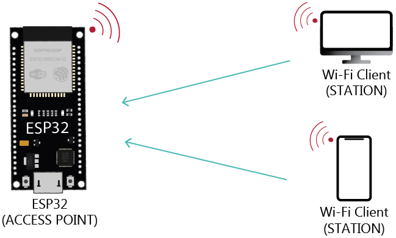

# Lab 7: Wi-Fi communication

### Learning objectives

After completing this lab you will be able to:

* Understand the Wi-Fi STA mode
* Use methods for connecting and disconnecting the Wi-Fi
* Perform data transfers between ESP32 and server via GET and POST requests
* Use the classes and modules

The main goal of this laboratory exercise is to understand Wi-Fi connectivity using MicroPython and introduce the concept of IoT (Internet of Things) by connecting the ESP32 to the ThingSpeak platform (or other).

### Table of contents

* [Pre-Lab preparation](#preparation)
* [Part 1: Wi-Fi scan](#part1)
* [Part 2: Wi-Fi Station mode](#part2)
* [Part 3: ThingSpeak online platform](#part3)
* [Part 4: (Optional) Network Time Protocol](#part4)
* [(Optional) Experiments on your own](#experiments)
* [References](#references)

### Components list

* ESP32 board, USB cable
* Breadboard
* DHT12 humidity/temperature sensor
* Jumper wires

<a name="preparation"></a>

## Pre-Lab preparation

1. Create an account on the [ThingSpeak](https://thingspeak.com/) IoT platform and optionally also on [OpenWeatherMap](https://openweathermap.org/) server for weather data.

2. Review the usage of the I2C communication in MicroPython.

3. Explore the usage of the `urequests` or `requests` library in MicroPython. Understand how to make HTTP requests and handle responses.

<a name="part1"></a>

## Part 1: Wi-Fi scan

The Wi-Fi scanning process on the ESP32 involves searching for available Wi-Fi networks in the vicinity. This is commonly used to provide information about nearby networks or to allow the ESP32 to connect to a specific Wi-Fi network.


Use the following code to create an instance of the `WLAN` class from the `network` module, specifying the desired Station mode, activate the Wi-Fi interface, and perform Wi-Fi scan.

See the documentation for [WLAN class](https://docs.micropython.org/en/latest/library/network.WLAN.html) description.

```python
import network

# Initialize the Wi-Fi interface in Station mode and activate it
wifi = network.WLAN(network.STA_IF)
wifi.active(True)

# Perform the Wi-Fi scan
print("Scanning Wi-Fi... ", end="")
nets = wifi.scan()
print(f"{len(nets)} network(s)")

# Print the list of available Wi-Fi networks
print("RSSI Channel \tSSID")
for net in nets:
    rssi = net[3]
    channel = net[2]
    ssid = net[0].decode("utf-8")
    print(f"{rssi}  (ch.{channel}) \t{ssid}")
```

> **Note:** The `.decode("utf-8")` method converts a sequence of bytes into a string using the UTF-8 encoding.

<a name="part2"></a>

## Part 2: Wi-Fi Station mode

ESP32 microcontrollers typically have two main modes of operation for the Wi-Fi interface: Station mode and Access Point mode.

In **Station Mode (`network.STA_IF`)** the ESP32 connects to an existing Wi-Fi network as a client. It can obtain an IP address from the network and access the Internet. This mode is suitable for scenarios where the ESP32 needs to connect to an existing Wi-Fi network, like a home or office network.


In **Access Point mode (`network.AP_IF`)** the ESP32 acts as a Wi-Fi access point (AP) and other devices (like smartphones or computers) can connect to the ESP32 and obtain an IP address. This mode is useful when you want the ESP32 to create its own Wi-Fi network.



The Wi-Fi modes can be activated or deactivated using the `active()` method of the `network` module. These modes can be used individually or in combination. For example, the ESP32 can operate in both Station and Access Point modes simultaneously (`network.WIFI_AP_STA`), allowing it to connect to an existing Wi-Fi network while also providing an access point for other devices.

In MicroPython on the ESP32, the `network.STA_IF` provides access to the interface's configuration and status. Use the following code, set your Wi-Fi settings, and connect to the network.

```python
import network

# Network settings
WIFI_SSID = "<YOUR WIFI SSID>"
WIFI_PSWD = "<YOUR WIFI PASSWORD>"


def connect_wifi(ssid, password):
    """
    Connect to Wi-Fi network.

    Activates the Wi-Fi interface, connects to the specified network,
    and waits until the connection is established.

    :return: None
    """
    from time import sleep_ms

    if not wifi.isconnected():
        # Activate the Wi-Fi interface
        wifi.active(True)

        # Connect to the specified Wi-Fi network
        wifi.connect(ssid, password)

        # Wait until the connection is established
        print(f"Connecting to {ssid}", end="")
        while not wifi.isconnected():
            print(".", end="")
            sleep_ms(100)

        print(" Done")
    else:
        print("Already connected")


def disconnect_wifi():
    """
    Disconnect from Wi-Fi network.

    Deactivates the Wi-Fi interface if active and checks if
    the device is not connected to any Wi-Fi network.

    :return: None
    """
    # Check if the Wi-Fi interface is active
    if wifi.active():
        # Deactivate the Wi-Fi interface
        wifi.active(False)

    # Check if the device is not connected to any Wi-Fi network
    if not wifi.isconnected():
        print("Disconnected")


# Initialize the Wi-Fi interface in Station mode
wifi = network.WLAN(network.STA_IF)

connect_wifi(WIFI_SSID, WIFI_PSWD)

# WRITE YOUR CODE HERE

disconnect_wifi()
```

When working with the `network.WLAN` class, `ifconfig()` is used to get or set the IP configuration of the interface. Place the following codes between `connect_wifi()` and `disconnect_wifi()` functions.

```python
# Get the current IP configuration of the interface
config = wifi.ifconfig()

# Print the configuration
print("Wi-Fi Configuration:")
print(f"IP address: \t{config[0]}")
print(f"Subnet mask:\t{config[1]}")
print(f"Gateway: \t{config[2]}")
print(f"DNS server:\t{config[3]}")
```

Apart from the IP configuration obtained using `ifconfig()`, you can also retrieve information such as:

**Signal strength (RSSI):**

```python
rssi = wifi.status("rssi")
print("Signal strength (RSSI):", rssi)
```

This will print the signal strength in dBm.

**MAC address:**

```python
mac_address = wifi.config('mac')
print("MAC address:", ':'.join(['{:02x}'.format(b) for b in mac_address]))
```

This code will print the MAC address of the ESP32.

**Is connected:**

```python
is_connected = wifi.isconnected()
print("Is connected:", is_connected)
```

This will print `True` if the ESP32 is connected to a Wi-Fi network, and `False` otherwise.

<a name="part3"></a>

## Part 3: ThingSpeak online platform

ThingSpeak is an Internet of Things (IoT) platform that allows you to collect, analyze, and visualize data from your connected devices. It provides APIs for storing and retrieving data, making it easy to integrate IoT devices into your projects. One common use case for ThingSpeak is to store and display sensor data.

1. Use breadboard, jumper wires, and connect I2C [DHT12](../../docs/dht12_manual.pdf) sensor to ESP32 GPIO pins as follows: SDA - GPIO 21, SCL - GPIO 22, VCC - 3.3V, GND - GND.

   > **Note:** Connect the components on the breadboard only when the supply voltage/USB is disconnected! There is no need to connect external pull-up resistors on the SDA and SCL pins, because the internal ones is used.

   

2. Create a ThingSpeak Account: If you don't have a ThingSpeak account, sign up at [ThingSpeak](https://thingspeak.com/).

3. Create a Channel: After logging in, create a new channel. A channel is where you will store your sensor data and you can create up to four channels.

4. Get Channel API Key: In your channel settings, you'll find an Write API Key. This key is used to authenticate your device when sending data to ThingSpeak.

5. Create a new file `dht12.py` and [copy/paste](../../solutions/06-serial/dht12.py) the class for DHT12 sensor. Save a copy of this file to the MicroPython device.

   Create a new file `mywifi.py` and [copy/paste](../../solutions/07-wifi/mywifi.py) the methods for connecting/disconnecting to Wi-Fi. Save a copy of this file to the MicroPython device.

6. Write a MicroPython script that reads data from the DHT12 sensor and sends it to ThingSpeak. Use the `urequests` library to make HTTP requests.

   > **Note:** When sending data to ThingSpeak from MicroPython using the ESP32 and a DHT12 sensor, the choice between GET and POST requests depends on your specific use case and preferences. Both methods are supported by ThingSpeak.
   >
   > **GET Request:**
   >   * Use GET requests when you want to send data as part of the URL.
   >   * Data is appended to the URL as query parameters.
   >   * GET requests are generally simpler to implement, especially for basic projects.
   >   * They can be easier to debug and test since you can see the data in the URL.
   >
   > **POST Request:**
   >   * Use POST requests when you have more data to send or when sending sensitive data (as it's not exposed in the URL).
   >   * Data is sent in the body of the HTTP request.
   >   * POST requests can accommodate larger payloads.

    ```python
    from machine import I2C
    from machine import Pin
    import time
    import dht12
    import network
    import mywifi
    import urequests  # Network Request Module

    # Network settings
    WIFI_SSID = "<YOUR WIFI SSID>"
    WIFI_PSWD = "<YOUR WIFI PASSWORD>"
    API_KEY = "<THINGSPEAK WRITE API KEY>"


    def read_sensor():
        sensor.measure()
        return sensor.temperature(), sensor.humidity()


    def send_to_thingspeak(temp, humidity):
        API_URL = "https://api.thingspeak.com/update"
        
        # Select GET or POST request
        # GET request
        url = f"{API_URL}?api_key={API_KEY}&field1={temp}&field2={humidity}"
        response = urequests.get(url)

        # POST request
        # url = f"{API_URL}?api_key={API_KEY}"
        # json = {"field1": temp, "field2": humidity}
        # headers = {"Content-Type": "application/json"}
        # response = urequests.post(url, json=json, headers=headers)

        print(f"Response from ThingSpeak: {response.text}")
        response.close()


    # Connect to the DHT12 sensor
    i2c = I2C(0, scl=Pin(22), sda=Pin(21), freq=100_000)
    sensor = dht12.DHT12(i2c)

    # Create Station interface
    wifi = network.WLAN(network.STA_IF)

    try:
        while True:
            temp, humidity = read_sensor()
            print(f"Temperature: {temp}°C, Humidity: {humidity}%")
            mywifi.connect(wifi, WIFI_SSID, WIFI_PSWD)
            send_to_thingspeak(temp, humidity)
            mywifi.disconnect(wifi)
            time.sleep(60)

    except KeyboardInterrupt:
        print("Ctrl+C pressed. Exiting...")
        mywifi.disconnect(wifi)
    ```

7. Go to your ThingSpeak channel to view the data being sent by your ESP32.

<a name="part4"></a>

## Part 4: (Optional) Network Time Protocol

The Network Time Protocol (NTP) is a protocol designed to synchronize the clocks of computers over a network with Coordinated Universal Time (UTC). NTP follows a client-server model, with clients requesting time information from servers and adjusting their local clocks based on the received server information.

1. Create a new script `04-wifi-ntp.py` and use the following code:

    ```python
    import network
    import mywifi
    import ntptime
    from machine import RTC

    # Network settings
    WIFI_SSID = "<YOUR WIFI SSID>"
    WIFI_PSWD = "<YOUR WIFI PASSWORD>"
    TIMEZONE_OFFSET = 1  # UTC+1:00 ... CET, UTC+2:00 ... CEST

    # Create Station interface
    wifi = network.WLAN(network.STA_IF)
    mywifi.connect(wifi, WIFI_SSID, WIFI_PSWD)

    # Get UTC time from NTP server and set it to RTC
    ntptime.host = "cz.pool.ntp.org"
    ntptime.settime()
    print("Local RTC synchronized")
    mywifi.disconnect(wifi)

    # Create an independent clock object
    rtc = RTC()

    # Print UTC time after NTP update
    print(rtc.datetime())
    (year, month, day, wday, hrs, mins, secs, subsecs) = rtc.datetime()
    # Update timezone
    rtc.init((year, month, day, wday, hrs+TIMEZONE_OFFSET, mins, secs, subsecs))
    print(rtc.datetime())

    # WRITE YOUR CODE HERE

    ```

2. Integrate a perpetual loop into your code, and at regular intervals, retrieve data from the local Real-Time Clock (RTC). Display the information in a formatted manner, such as `yyyy-mm-dd hh:mm:ss`.

<a name="experiments"></a>

## (Optional) Experiments on your own

1. Create a functional weather monitoring system. The primary goal is to establish a Wi-Fi connection, access real-time weather data from the [OpenWeatherMap API](https://openweathermap.org/current), and display the information to the shell or on a local OLED screen.

2. Implement a simple web server on the ESP32 that responds to HTTP requests. Explore handling different types of requests, such as GET and POST, and responding with various types of content, like HTML pages or JSON data.

<a name="references"></a>

## References

1. Engineers Garage. [How to use MicroPython with ESP8266 and ESP32 to connect to a WiFi network](https://www.engineersgarage.com/micropython-wifi-network-esp8266-esp32/)

2. [OpenWeather](https://openweathermap.org/)
